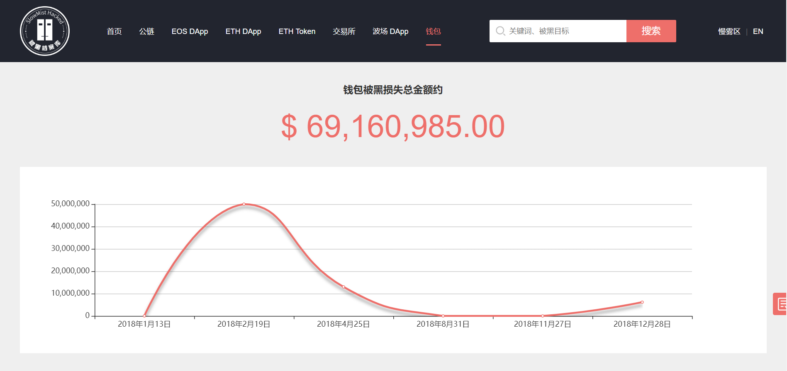
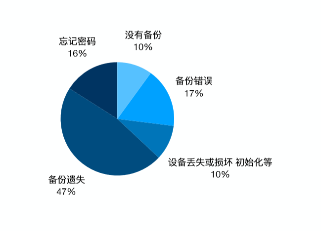

# 区块链安全入门笔记(一) | 慢雾科普

随着越来越的人参与到区块链这个行业中来，为行业注入新活力的同时也由于相关知识的薄弱以及安全意识的匮乏，给了攻击者更多的可乘之机。面对频频爆发的安全事件，慢雾特推出区块链安全入门笔记系列，向大家介绍区块链安全相关名词，让新手们更快适应区块链危机四伏的安全攻防世界。

## 钱包 Wallet

钱包(Wallet)是一个管理私钥的工具，数字货币钱包形式多样，但它通常包含一个软件客户端，允许使用者通过钱包检查、存储、交易其持有的数字货币。它是进入区块链世界的基础设施和重要入口。
 
据 SlowMist Hacked 统计，仅 2018 年因“钓鱼”、“第三方劫持”等原因所造成的钱包被黑损失总金额就达 69,160,985 美元，深究根本，除了部分钱包本身对攻击防御的不全面之外，最主要的是钱包持有者们的安全防范意识不强。

## 冷钱包 Cold Wallet

冷钱包(Cold Wallet)是一种脱离网络连接的离线钱包，将数字货币进行离线储存的钱包。使用者在一台离线的钱包上面生成数字货币地址和私钥，再将其保存起来。冷钱包是在不需要任何网络的情况下进行数字货币的储存，因此黑客是很难进入钱包获得私钥的，但它也不是绝对安全的，随机数不安全也会导致这个冷钱包不安全，此外硬件损坏、丢失也有可能造成数字货币的损失，因此需要做好密钥的备份。

## 热钱包 Hot Wallet

热钱包(Hot Wallet)是一种需要网络连接的在线钱包，在使用上更加方便。但由于热钱包一般需要在线使用，个人的电子设备有可能因误点钓鱼网站被黑客盗取钱包文件、捕获钱包密码或是破解加密私钥，而部分中心化管理钱包也并非绝对安全。因此在使用中心化交易所或钱包时，最好在不同平台设置不同密码，且开启二次认证，以确保自己的资产安全。

## 公钥 Public Key

公钥(Public Key)是和私钥成对出现的，和私钥一起组成一个密钥对，保存在钱包中。公钥由私钥生成，但是无法通过公钥倒推得到私钥。公钥能够通过一系列算法运算得到钱包的地址，因此可以作为拥有这个钱包地址的凭证。

## 私钥 Private Key

私钥(Private Key)是一串由随机算法生成的数据，它可以通过非对称加密算法算出公钥，公钥可以再算出币的地址。私钥是非常重要的，作为密码，除了地址的所有者之外，都被隐藏。区块链资产实际在区块链上，所有者实际只拥有私钥，并通过私钥对区块链的资产拥有绝对控制权，因此，区块链资产安全的核心问题在于私钥的存储，拥有者需做好安全保管。
 
和传统的用户名、密码形式相比，使用公钥和私钥交易最大的优点在于提高了数据传递的安全性和完整性，因为两者——对应的关系，用户基本不用担心数据在传递过程中被黑客中途截取或修改的可能性。同时，也因为私钥加密必须由它生成的公钥解密，发送者也不用担心数据被他人伪造。

## 助记词 Mnemonic

由于私钥是一长串毫无意义的字符，比较难以记忆，因此出现了助记词(Mnemonic)。助记词是利用固定算法，将私钥转换成十多个常见的英文单词。助记词和私钥是互通的，可以相互转换，它只是作为区块链数字钱包私钥的友好格式。所以在此强调：助记词即私钥！由于它的明文性，不建议它以电子方式保存，而是抄写在物理介质上保管好，它和 Keystore 作为双重备份互为补充。

## Keystore

Keystore 主要在以太坊钱包 App 中比较常见(比特币类似以太坊 Keystore 机制的是：BIP38)，是把私钥通过钱包密码再加密得来的，与助记词不同，一般可保存为文本或 JSON 格式存储。换句话说，Keystore 需要用钱包密码解密后才等同于私钥。因此，Keystore 需要配合钱包密码来使用，才能导入钱包。当黑客盗取 Keystore 后，在没有密码情况下, 有可能通过暴力破解 Keystore 密码解开 Keystore，所以建议使用者在设置密码时稍微复杂些，比如带上特殊字符，至少 8 位以上，并安全存储。

由于区块链技术的加持使得区块链数字钱包安全系数高于其他的数字钱包，其中最为关键的就是两点：防盗和防丢。相比于盗币事件原因的多样化，造成丢币事件发生的原因主要有五个类型：没有备份、备份遗失、忘记密码、备份错误以及设备丢失或损坏。因此，我们在备份一个区块链数字钱包的时候，对私钥、助记词、Keystore 一定要进行多重、多次备份，把丢币的风险扼杀在摇篮之中。最后为大家提供一份来自 imToken 总结的钱包安全“十不原则”：

1. 不使用未备份的钱包
2. 不使用邮件传输或存储私钥
3. 不使用微信收藏或云备份存储私钥
4. 不要截屏或拍照保存私钥
5. 不使用微信、QQ 传输私钥
6. 不要将私钥告诉身边的人
7. 不要将私钥发送到群里
8. 不使用第三方提供的未知来源钱包应用
9. 不使用他人提供的 Apple ID
10. 不要将私钥导入未知的第三方网站

