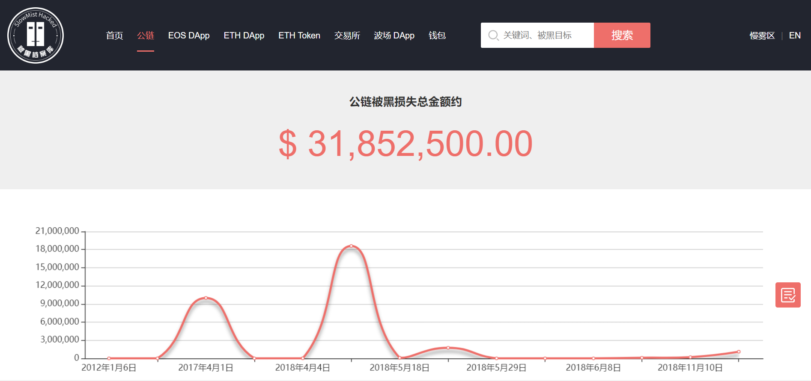
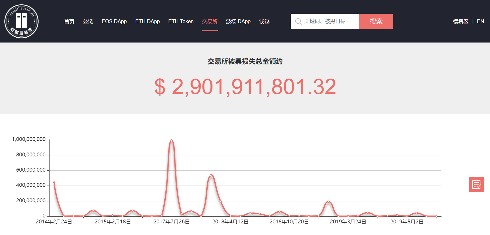
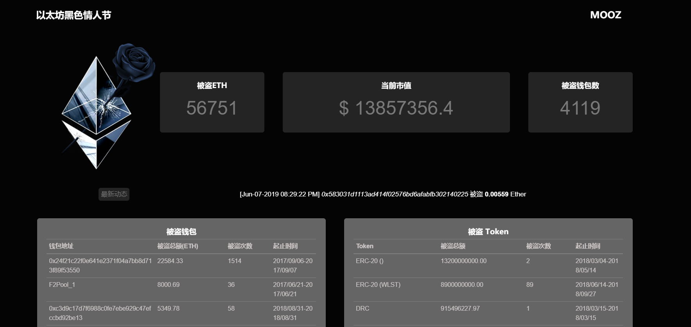

# 区块链安全入门笔记(二) | 慢雾科普

随着越来越的人参与到区块链这个行业中来，为行业注入新活力的同时也由于相关知识的薄弱以及安全意识的匮乏，给了攻击者更多的可乘之机。面对频频爆发的安全事件，慢雾特推出区块链安全入门笔记系列，向大家介绍区块链安全相关名词，让新手们更快适应区块链危机四伏的安全攻防世界。

[回到目录](./README.md)

### 公链 Public Blockchain

公有链(Public Blockchain)简称公链，是指全世界任何人都可随时进入读取、任何人都能发送交易且能获得有效确认的共识区块链。公链通常被认为是完全去中心化的，链上数据都是公开透明的，不可更改，任何人都可以通过交易或挖矿读取和写入数据。一般会通过代币机制(Token)来鼓励参与者竞争记账，来确保数据的安全性。

由于要检测所有的公链的工作量非常大，只靠一家公司不可能监测整个区块链生态安全问题，这就导致了黑客极有可能在众多公链之中找寻到漏洞进行攻击。2017 年 4 月 1 日，Stellar 出现通胀漏洞，一名攻击者利用此漏洞制造了 22.5 亿的 Stellar 加密货币 XLM，当时价值约 1000 万美元。

### 交易所 Exchange

与买卖股票的证券交易所类似，区块链交易所即数字货币买卖交易的平台。数字货币交易所又分为中心化交易所和去中心化交易所。

**去中心化交易所：**交易行为直接发生在区块链上，数字货币会直接发回使用者的钱包，或是保存在区块链上的智能合约。这样直接在链上交易的好处在于交易所不会持有用户大量的数字货币，所有的数字货币会储存在用户的钱包或平台的智能合约上。去中心化交易通过技术手段在信任层面去中心化，也可以说是无需信任，每笔交易都通过区块链进行公开透明，不负责保管用户的资产和私钥等信息，用户资金的所有权完全在自己手上，具有非常好的个人数据安全和隐私性。目前市面上的去中心化交易所有 WhaleEx、Bancor、dYdX 等

**中心化交易所：**目前热门的交易所大多都是采用中心化技术的交易所，使用者通常是到平台上注册，并经过一连串的身份认证程序(KYC)后，就可以开始在上面交易数字货币。用户在使用中心化交易所时，其货币交换不见得会发生在区块链上，取而代之的可能仅是修改交易所数据库内的资产数字，用户看到的只是账面上数字的变化，交易所只要在用户提款时准备充足的数字货币可供汇出即可。当前的主流交易大部分是在中心化交易所内完成的，目前市面上的中心化交易所有币安，火币，OKEx 等。
 
由于交易所作为连接区块链世界和现实世界的枢纽，储存了大量数字货币，它非常容易成为黑客们觊觎的目标，截止目前全球数字货币交易所因安全问题而遭受损失金额已超过 29 亿美元(数据来源 SlowMist Hacked)。

数字货币领域，攻击者的屠戮步伐从未停止。激烈的攻防对抗之下，防守方处于绝对的弱势，其攻击手法多种多样，我们会在之后的文章中为大家进行介绍。职业黑客往往会针对数字货币交易所开启定向打击，因此慢雾安全团队建议各方交易所加强安全建设，做好风控和内控安全，做到：“早发现，早预警，早止损。”

相关交易所防御建议可参考：
[慢雾红色警报：交易所接连被黑的防御建议](https://mp.weixin.qq.com/s/oZDEMyO5JkXNEeJ6PucLMA)

### 节点 Node

在传统互联网领域，企业所有的数据运行都集中在一个中心化的服务器中，那么这个服务器就是一个节点。由于区块链是去中心化的分布式数据库，是由千千万万个“小服务器”组成。区块链网络中的每一个节点，就相当于存储所有区块数据的每一台电脑或者服务器。所有新区块的生产，以及交易的验证与记帐，并将其广播给全网同步，都由节点来完成。节点分为“全节点”和“轻节点”，全节点就是拥有全网所有的交易数据的节点，那么轻节点就是只拥有和自己相关的交易数据节点。由于每一个全节点都保留着全网数据，这意味着，其中一个节点出现问题，整个区块链网络世界也依旧能够安全运行，这也是去中心化的魅力所在。

### RPC

远程过程调用(Remote Procedure Call，缩写为 RPC)是一个计算机通信协议。以太坊 RPC 接口是以太坊节点与其他系统交互的窗口，以太坊提供了各种 RPC 调用：HTTP、IPC、WebSocket 等等。在以太坊源码中，server.go 是核心逻辑，负责 API 服务的注入，以及请求处理、返回。http.go 实现 HTTP 的调用，websocket.go 实现 WebSocket 的调用，ipc.go 实现 IPC 的调用。以太坊节点默认在 8545 端口提供了 JSON RPC 接口，数据传输采用 JSON 格式，可以执行 Web3 库的各种命令，可以向前端（例如 imToken、Mist 等钱包客户端）提供区块链上的信息。

### 以太坊黑色情人节漏洞 ETH Black Valentine's Day

2018 年 3 月 20 日，慢雾安全团队观测到一起自动化盗币的攻击行为，攻击者利用以太坊节点 Geth/Parity RPC API 鉴权缺陷，恶意调用 eth_sendTransaction 盗取代币，持续时间长达两年，单被盗的且还未转出的以太币价值就高达现价 2 千万美金(以当时 ETH 市值计算)，还有代币种类 164 种，总价值难以估计（很多代币还未上交易所正式发行）。

通过慢雾安全团队独有的墨子（MOOZ）系统对全球约 42 亿 IPv4 空间进行扫描探测，发现暴露在公网且开启 RPC API 的以太坊节点有 1 万多个。这些节点都存在被直接盗币攻击的高风险。这起利用以太坊 RPC 鉴权缺陷实施的自动化盗币攻击，已经在全球范围内对使用者造成了非常严重的经济损失。

漏洞详情及修复方案可点击：

[以太坊生态缺陷导致的一起亿级代币盗窃大案](https://mp.weixin.qq.com/s/Kk2lsoQ1679Gda56Ec-zJg)

[以太坊黑色情人节事件数据统计及新型攻击手法披露](https://mp.weixin.qq.com/s/JrsiT3t9x-4L9i3j1Ps5_A)

[回到目录](./README.md)