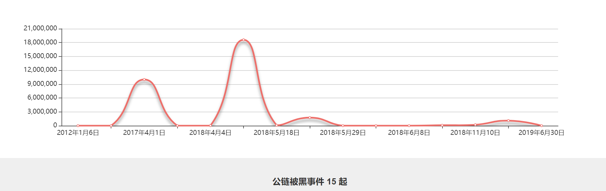

# 区块链安全入门笔记(四) | 慢雾科普

随着越来越的人参与到区块链这个行业中来，为行业注入新活力的同时也由于相关知识的薄弱以及安全意识的匮乏，给了攻击者更多的可乘之机。面对频频爆发的安全事件，慢雾特推出区块链安全入门笔记系列，向大家介绍区块链安全相关名词，让新手们更快适应区块链危机四伏的安全攻防世界！

### 多签 Multi-sig

多签(Multi-sig)指的是需要多个签名才能执行的操作(这些签名是不同私钥生成的)。这可用于提供更高的安全性，即使丢失单个私钥的话也不会让攻击者取得帐户的权限，多个值得信赖的各方必须同时批准更新，否则无效。

我们都知道，一般来说一个比特币地址对应一个私钥，动用这个地址中的资金需要私钥的持有者发起签名才行。而多重签名技术，简单来说，就是动用一笔资金时需要多个私钥签名才有效。多签的一个优势就是可以多方对一笔付款一起达成共识，才能支付成功。

### 双花攻击 Double Spend Attack

双花攻击(Double Spend Attack)即一笔钱花了两次，双重支付，利用货币的数字特性两次或多次使用“同一笔钱”完成支付。双花不会产生新的 Token，但能把自己花出去的钱重新拿回来。简单说就是，攻击者将一笔 Token 转到另外一个地址，通常是转到交易所进行套现，然后再利用一些攻击手法对转账交易进行回滚。目前有常见的几种手法能够引发双花攻击：

####1. Race Attack

这种攻击主要通过控制矿工费来实现双花。攻击者同时向网络中发送两笔交易，一笔交易发给自己(为了提高攻击成功的概率，他给这笔交易增加了足够的矿工费)，一笔交易发给商家。由于发送给自己的交易中含有较高的手续费，会被矿工优先打包进区块的概率比较高。这时候这笔交易就会先于发给商家的那笔交易，那么发给商家的交易就会被回滚。对于攻击者来说，通过控制矿工费，就实现了同一笔 Token 的“双花”。

 

####2. Finney Attack

攻击者主要通过控制区块的广播时间来实现双花，攻击对象针对的是接受 0 确认的商家。假设攻击者挖到区块，该区块中包含着一个交易，即 A 向 B 转了一定数量的 Token，其中 A 和 B 都是攻击者的地址。但是攻击者并不广播这个区块，而是立即找到一个愿意接受 0 确认交易的商家向他购买一个物品，向商家发一笔交易，用 A 向商家的地址 C 支付，发给商家的交易广播出去后，攻击者再把自己之前挖到的区块广播出去，由于发给自己的交易先于发给商家的交易，对于攻击者来说，通过控制区块的广播时间，就实现了同一笔 Token 的“双花”。

####3. Vector76 attack

Vector76 Attack 又称“一次确认攻击”，也就是交易确认一次后仍然可以回滚，是 Finney Attack 和 Race Attack 的组合。

攻击者创建两个节点，节点 A 连接到商家节点，节点 B 连接到区块链网络中的其他节点。接着，攻击者用同一笔 Token 发起两笔交易，一笔交易发送给商家地址，我们称为交易 1；一笔交易发送给自己的钱包地址，我们称为交易 2。与上面说的 Race Attack 一样，攻击者对交易 2 添加了较高的矿工费从而提高了矿工的打包概率，此时，攻击者并没有把这两笔交易广播到网络中去。

接着，攻击者开始在交易 1 所在的分支上进行挖矿，这条分支我们命名为分支 1。攻击者挖到区块后，并没有广播出去，而是同时做了两件事：在节点 A 上发送交易 1，在节点 B 上发送交易 2。

由于节点 A 只连接了商家节点，所以当商家节点想把交易 1 传给其它对等节点时，连接了更多节点的节点 B，已经把交易 2 广播给了网络中的大部分节点。于是，从概率上来讲，交易 2 就更有可能被网络认定为是有效的，交易 1 被认定为无效。

交易 2 被认为有效后，攻击者立即把自己之前在分支 1 上挖到的区块，广播到网络中。这时候，这个接受一次确认就支付的商家，会确认交易成功，然后攻击者就可以立即变现并转移资产。

同时，由于分支 2 连接的更多节点，所以矿工在这个分支上挖出了另一个区块，也就是分支 2 的链长大于分支 1 的链长。于是，分支 1 上的交易就会回滚，商家之前支付给攻击者的交易信息就会被清除，但是攻击者早已经取款，实现了双花。

#### 4. 51% attack

攻击者占有超过全网 50% 的算力，在攻击者控制算力的这段时间，他可以创造一条高度大于原来链的新链。那么旧链中的交易会被回滚，攻击者可以使用同一笔 Token 发送一笔新的交易到新链上。

目前已知公链安全事件的攻击手法多为 51% 攻击，截止发稿日由于攻击者掌握大量算力发起 51% 攻击所造成的损失共 19,820,000 美金。2019 年 1 月 6 日，慢雾区预警了 ETC 网络的 51% 算力攻击的可能性，据 Coinbase 博客报道该攻击者总共发起了 15 次攻击，其中 12 次包含双花，共计被盗 219,500 ETC(按当时市价约为 110 万美元)，攻击者经过精心准备，通过租借大量算力向 ETC 发动了 51% 攻击，累计收益超 10 倍，Gate.io、Yobit、Bitrue 等交易所均受到影响。所幸在整个 ETC 生态社区的努力下，一周后攻击者归还了攻击所得收益，幸而没有造成进一步的损失。

###软分叉 Soft-fork

软分叉(Soft-fork)更多情况下是一种协议升级，当新共识规则发布后，没有升级的旧节点并不会意识到代码已经发生改变，而继续生产不合法的区块，就会产生临时性分叉，但新节点可以兼容旧节点，即新旧节点始终在同一条链上工作。

###硬分叉 Hard-fork

硬分叉(Hard-fork)是区块链发生永久性分歧，在新共识规则发布后，已经升级的节点无法验证未升级节点产生的区块，未升级节点也无法验证已经升级的节点产生的区块，即新旧节点互不兼容，通常硬分叉就会发生，原有正常的一条链被分成了两条链（已升级的一条链和未升级的一条链，且这两条链互不兼容）。

历史上比较著名的硬分叉事件是 The DAO 事件，作为以太坊上的一个著名项目，由于智能合约的漏洞造成资金被黑客转移，黑客盗取了当时价值约 6000 万美元的 ETH，让这个项目蒙受了巨大的损失。为了弥补这个损失，2016 年 7 月，以太坊团队修改了以太坊合约代码实行硬分叉，在第 1920000 个区块强行把 The DAO 及其子 DAO 的所有资金全部转到一个特定的退款合约地址，进而“夺回”了黑客所控制 DAO 合约上的币。但这个修改被一部分矿工所拒绝，因而形成了两条链，一条为原链(以太坊经典，ETC)，一条为新的分叉链(ETH)，他们各自代表了不同社区的共识和价值观。

