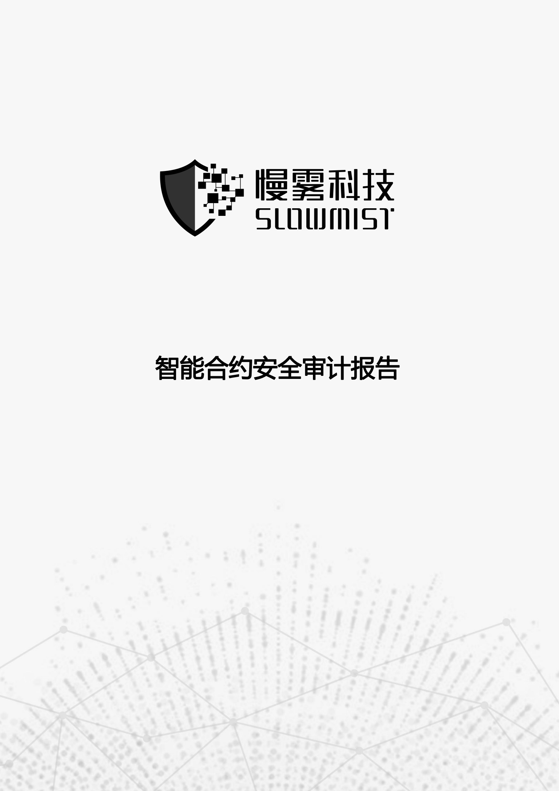
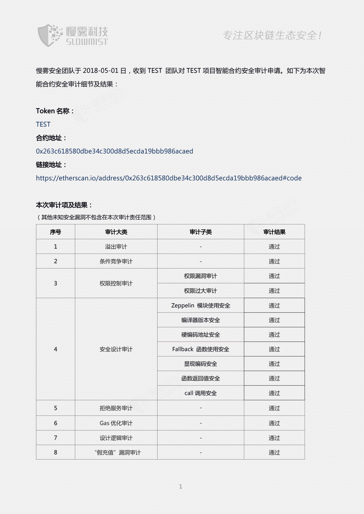
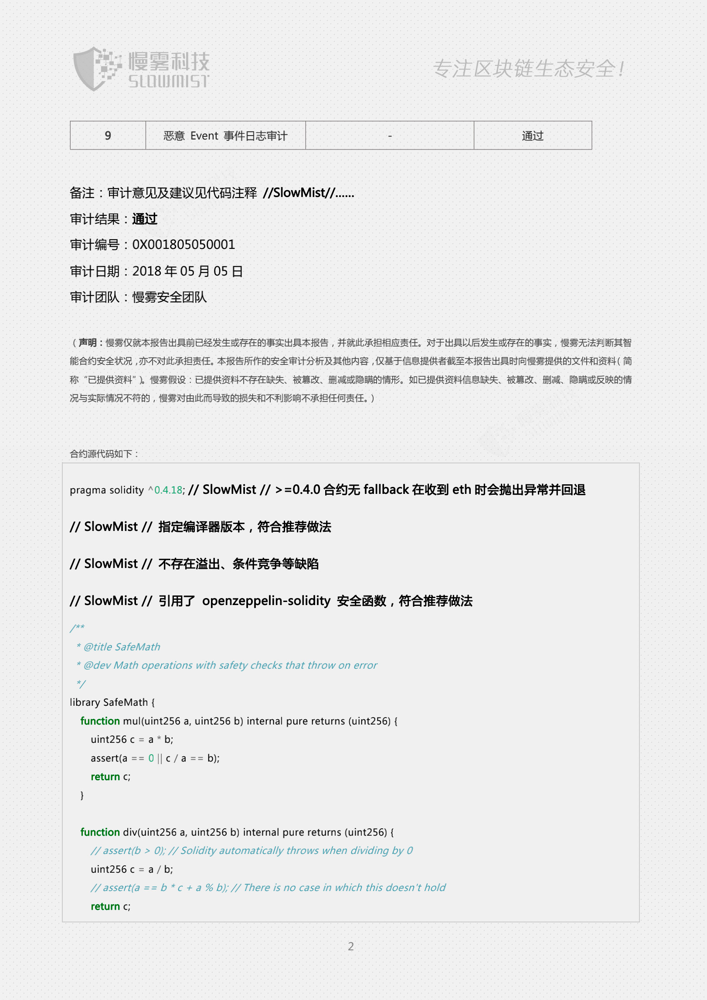
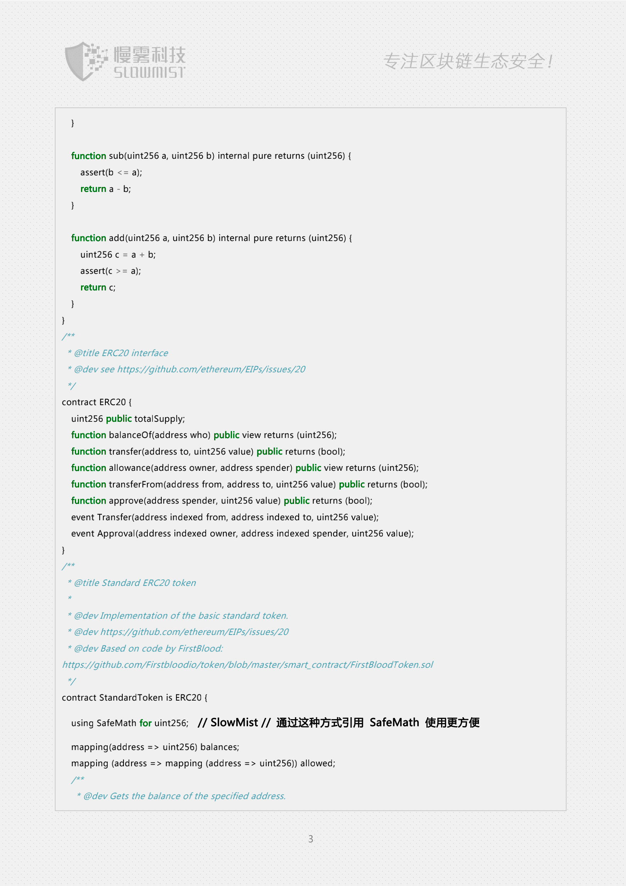
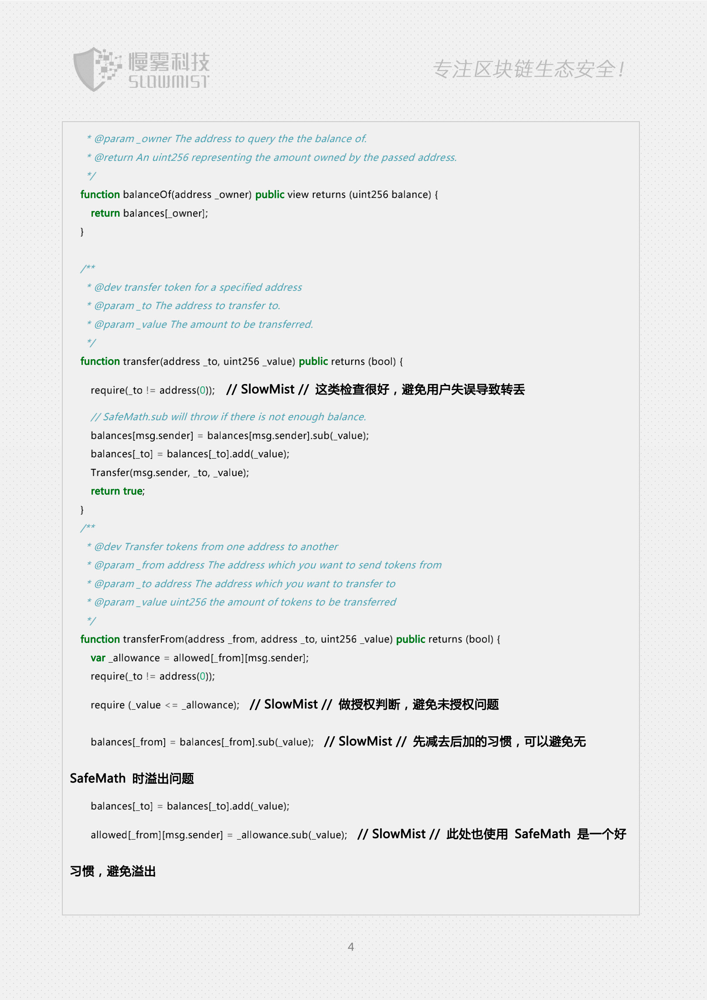
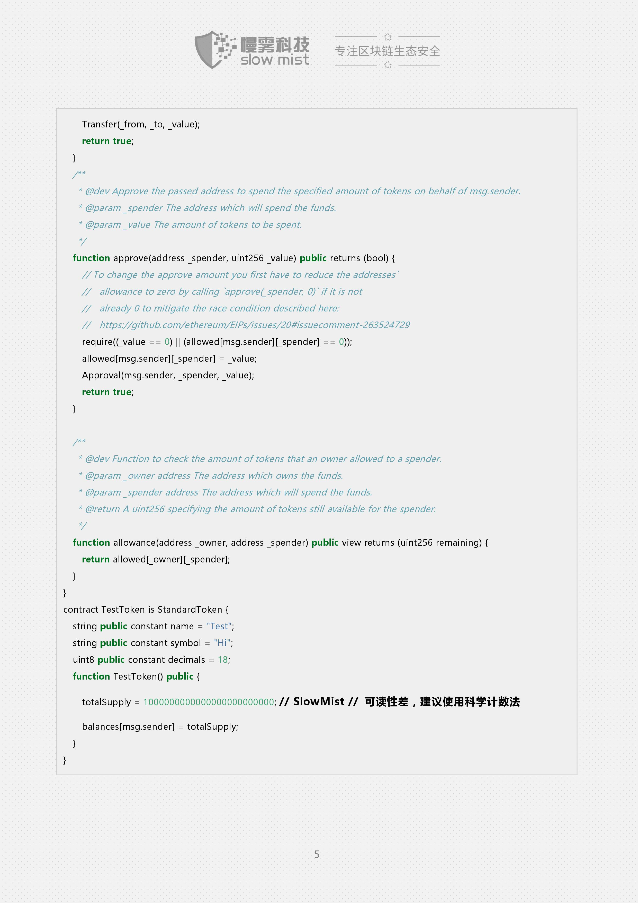
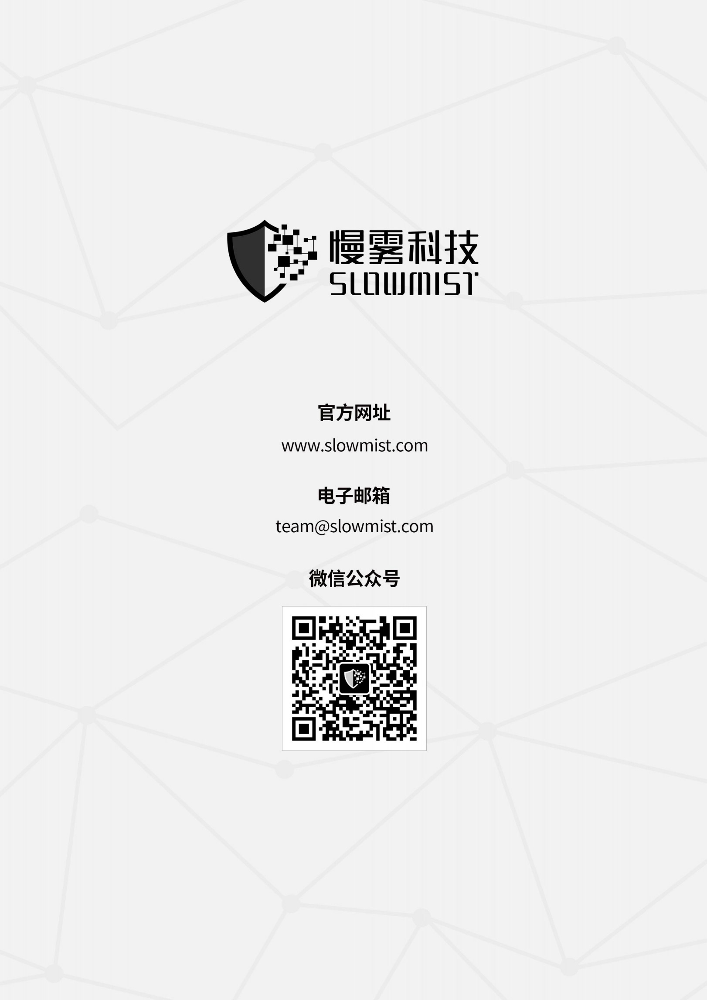

# 智能合约安全审计报告 demo

## 审计内容

* 溢出审计
* 条件竞争审计
* 权限控制审计
	* 权限漏洞审计
	* 权限过大审计
* 安全设计审计
	* Zeppelin 模块使用安全
	* 编译器版本安全
	* 硬编码地址安全
	* Fallback 函数使用安全
	* 显现编码安全
	* 函数返回值安全
	* call 调用安全
* 拒绝服务审计
* Gas 优化审计
* 设计逻辑审计
* “假充值”漏洞审计
* 恶意 Event 事件日志审计

[更多安全审计服务](https://www.slowmist.com/?f=github)

## 审计报告

