# 全面解析公共区块链系统攻击面

> 翻译：Johan@慢雾科技  
> 作者：Muhammad Saad, Jeffrey Spaulding, Laurent Njilla, Charles Kamhoua, Sachin Shetty, DaeHun Nyang, and Aziz Mohaisen  
> 原文：《Exploring the Attack Surface of Blockchain: A Systematic Overview》  

## 摘要  
在本文中，我们系统地探索区块链技术的攻击面，重点是公共区块链。为实现这一目标，我们将攻击面的攻击可行性归因于：  
1）区块链加密结构；  
2）区块链系统的分布式架构；  
3）区块链应用程序上下文。  
对于每个成因，我们概述了几种攻击方法，包括自私挖矿，51％攻击，域名系统（DNS）攻击，分布式拒绝服务（DDoS）攻击，共识延迟（由于自私挖矿或DDoS），区块链分叉，孤块和旧块，扣块，钱包盗窃，智能合约攻击和隐私攻击。我们还探索了这些攻击之间的因果关系，以证明各种攻击向量如何相互连接。这项工作的次要贡献是概述了区块链的有效防御措施，或为研究人员提出缓解攻击和漏洞修补措施提供建议。  
## I. 介绍  
区块链技术正在许多创新应用中被探索，例如加密货币，智能合约，通信系统，医疗保健，物联网，金融系统，抵抗审查，电子投票和分布式溯源等等。使用区块链的透明且完全分布式的对等体系结构，这些应用受益于这样一个追加模型，即区块链中接受的“事务”无法被修改。区块链的透明度使得它能够存储可公开验证和不可否认的记录。此外，区块链的点对点系统提供可验证的分类账维护，无需集中授权，从而解决了单点故障和单点信任问题。例如，比特币（一种使用区块链技术的流行加密货币）利用上述属性，可以轻松验证金融交易的历史。  
尽管区块链为应用程序的设计空间带来了更多的功能特性，但最近的报告指出了与该技术相关的安全风险。例如，2016年6月，一名未知的攻击者设法从“DAO”中取走了5000万美元，“DAO”是一个分散的自治组织，运行基于区块链的智能合约，或者说是管理该组织的预编程规则。 2016年8月，价值7200万美元的比特币在香港的交易平台Bitfinex被盗。 2017年6月，Bitfinex也遭遇了分布式拒绝服务（DDoS）攻击，导致其暂停服务。一些比特币和以太坊（基于区块链的分布式计算平台）的交易所，也经常遭受DDoS攻击和DNS攻击，从而阻碍了用户的服务可用性。  
这些攻击通常是在区块链应用层上发起的，因为它们的受欢迎程度或市值较高。例如，对于比特币，此类攻击可能导致加密货币贬值，矿业奖励损失，甚至加密货币交易所的关闭。比特币的区块链还遭受粉尘或垃圾交易攻击，以延迟合法交易的处理。 2017年5月，8月和11月，比特币的内存池充斥着粉尘交易，造成交易验证失速和延误，比特币采矿手续费大涨。例如，2017年11月的交易失败导致比特币的支付延迟达7亿美元。这种攻击的目的通常是激励比特币用户转移到其他事务处理时间更快的加密货币上。  
由于公开可验证的性质，基于区块链的密码可能容易受到多种欺诈活动的影响。Mt.Gox是日本的比特币货币交易所，遭到两名恶意用户的攻击，他们窃取了价值4.6亿美元的比特币。攻击者从比特币的区块链中收集了有用的信息，并设计了一个虚假的交易波动来提高市场价格。由于这样的活动，Mt.Gox遭受重创，最终破产。  
在2018年5月和6月，五个基于区块链的加密货币，即Monacoin，比特币黄金，Zencash，Verge和莱特现金，被51％攻击，导致500万美元的损失。每个加密货币中的攻击者都能够获得超过51％的网络哈希率，这些哈希率用于重新排列交易并阻止其他矿工进行计算。因此，他们能够控制区块链，并在有价值的交易中进行双重支出。  
区块链系统的安全性对潜在用户的可接受性很重要。例如，投资者在研究与其投资和使用该技术相关的风险时会考虑比特币的安全性。了解与区块链系统相关的威胁通常是实现构建在其上的应用程序潜力的第一步。为此，这项工作致力于深入了解区块链的攻击面。  
我们设想区块链将在许多应用程序中使用，我们会报告可能危及这些应用程序的攻击。也就是说，本文中区块链攻击的分类法分为三大类：  
1）与用于创建分类帐的数学技术相关的攻击（例如，区块链分叉，旧块，孤块等），   
2）与区块链系统中使用的对等架构相关的攻击（例如，自私挖矿，51％攻击，共识延迟，DDoS攻击，域名系统（DNS）攻击，预扣攻击等），  
3）与使用区块链技术的应用程序上下文相关的攻击（例如，扣块，双重花费，钱包盗窃等）。  
在本文中，我们主要关注公共且无需许可区块链的攻击面。公共区块链适用于提供对系统资源的开放访问同时保留用户匿名性的应用程序，这些属性非常适合具有弱信任模型和高度透明要求的系统。一方面，弱信任模型源于应用程序对匿名玩家的容忍度；另一方面，高度透明意味着任何人都可以访问公共资源来透明地审核数据。例如，在以太坊中，任何用户都可以通过在他们的机器上运行以太坊软件客户端并参与交易处理来加入网络。由于区块链是公开的，系统外的任何人都可以验证交易和区块的真实性。因此，公共区块链仍然是区块链应用程序中的主要组成部分，正如比特币和以太坊的普及所示。另一方面，弱信任模型将公共区块链暴露给各种各样的攻击，使攻击者很容易破坏系统。因此，虽然公共区块链对开放式访问系统很有用，但它们不适用于由于弱信任模型给攻击者创建攻击机会的封闭环境。  
为了解决公共区块链的缺点并减少攻击机会，私有和需要许可的区块链现在用于各种应用。在私有区块链中，对系统资源的访问仅限于一组选定的节点，这些节点在申请中被预先筛选出来。由于关于对等体的信息是已知的，因此可以将它们的身份与其行为联系起来以防止攻击。尽管私有区块链仍然在许可设置中充当信任代理，但由于信任模型更强，它们不会显著暴露于对抗性攻击中。由于这项工作的目的是探索和理解区块链的攻击面，因此更多地关注公共区块链是很自然的。但是，如有必要，我们还将讨论私有区块链的安全性和性能。  
#### 贡献  
总之，我们在本文中做出以下贡献。   
（1）我们调查了与区块链设计结构、对等体系结构以及区块链的使用相关的可能攻击。   
（2）我们探讨了这些攻击的起源以及它们对区块链应用程序及其用户的影响方式。  
（3）我们还展示了一系列攻击之间的关系，以概述一次攻击如何促进其他攻击的可能性。了解这些链接有助于设计一种可以同时解决多个问题的常见方法。   
（4）在先前的工作的基础上，针对每个攻击类别，我们还探讨了为加强区块链安全而提出的可能的防御策略。由于与特定分类相关的许多攻击都有共同的防御或补救措施，而其他攻击仍然是一个开放的问题，我们讨论每个分类的综合对策。此外，通过突出吸取的经验教训，我们还提供了未来的研究方向，以更系统地处理区块链攻击面。   
（5）在表I和表II中，我们提供了区块链攻击面的概述。我们将各种攻击按攻击结果分类。  
  
  
#### 内容组织方式  
本文的其余部分安排如下：  
在第二部分，我们呈献了这项工作的动力。  
在第三部分，我们概述了区块链的运作。  
在第四节中，我们回顾了区块链的设计结构，它可以实现各种攻击，例如区块链分叉，孤块和旧块。  
在第五节中，我们研究了分布式网络的特性，这些特性为51％的攻击，DNS攻击，DDoS攻击，共识延迟等创造了可能性。我们进一步描述了点对点架构的各个方面，使其能够实现区块链应用程序中可能存在的误用。  
在第六节中，我们概述了区块链中发现的特定于应用程序的漏洞，并评估了它们面临的威胁。  
随后是第八节的讨论和开放性挑战，以及第九节的结论性发言。  
## II. 动机和目标受众  
这项工作的动机是通过系统和全面的研究，引起人们对区块链系统的安全漏洞的关注。最近，区块链技术得到了极大的关注，其应用正在各个领域进行探索。区块链能够增强信任并在分布式系统中提供出处。虽然承认它们的优点，但我们认为理解它们的缺点很重要，特别是与安全性有关，正如大型安全事件所示。为此，我们的工作是努力突出区块链中的潜在漏洞，重点是流行的公共区块链应用程序。我们系统地分析各种攻击媒介并研究它们之间的关系。同时，我们还调查对各种攻击面元素的对策和防御，并提供未来的研究方向。  
由于各种研究和技术部门都对使用区块链感兴趣，因此需要对区块链攻击面进行更深入了解，从而为其安全性奠定基础。例如，在金融部门使用公共区块链可以通过简单地利用区块链的性质来防止欺诈和数据篡改，尽管这也可能会将金融交易的敏感信息暴露给对手。同样，正在探索基于区块链的智能系统的组织虽然可能在解决功能需求方面受益匪浅，但需要了解编程语言的约束和缺点，以及编译错误，这可能导致数据泄露和关键资产损失。对于这项以研究为导向的努力，我们相信我们的工作有可能为设计更安全，更强大的区块链解决方案提供未来方向，这些解决方案可以克服本调查其余部分所述的一些挑战。其中一些挑战包括构建安全，可扩展且高效的新共识算法。此外，他们还必须具备足够的竞争能力去防止一些攻击，例如自私挖矿，双重支出，多数攻击和孤块攻击。为了应对我们所列出的这些攻击，我们通过调查文献中提出的现有对策来补充我们的工作。这些对策可用作构建块，以实现更安全和更具有鲁棒性解决方案。  
总之，这项工作的目标受众包括两者：有兴趣了解区块链攻击情况的学者，以及对这些攻击的现有解决方案感兴趣的从业者，都可受益于此系统分析。  
## III. 区块链概述及其运作  
从概念上讲，区块链可以被视为数据存储库，由于其在对等系统中的所有节点上的复制，因可防止被篡改。事务代表驱动区块链应用程序的事件（例如，在加密存储中，令牌是用户之间交换的事务）。区块链应用程序使用各种共识算法在对等体之间对分类账进行信任。此外，共识算法确保区块链的一致性和透明性，从而解决冲突和分叉。也就是说，区块链中要满足共识算法的条件才能添加块。此外，每种算法都具有独特的功能和操作属性去推动区块链的共识。  
虽然区块链中的共识算法可能会有所不同，但区块链数据结构及其网络架构在所有应用程序中保持一致。例如，在两个流行的区块链应用程序，即比特币和点点币中，共识算法分别是工作证明和股权证明。虽然它们在达成共识的方式上有所不同，但这两个应用程序具有相同的区块链数据结构，其中链在追加模型中进行，并且每个块通过单向散列函数链接到前一个块。在两种加密货币中，系统副本都以对等模型连接，维护分类帐的单个副本。在下文中，我们将简要讨论流行的共识算法以及区块链中使用的基本加密原语。  
### A. 共识算法  
区块链中使用的一些值得注意的共识算法包括工作量证明（PoW），股权证明（PoS），权威证明（PoA），容量证明（PoC），燃烧证明（PoB），知识证明（PoK）和实用拜占庭容错（PBFT）。在区块链中最广泛流行使用的一致性算法是PoW，其次是PoS和PBFT。我们在下面讨论它们。  
#### 工作量证明  
在PoW区块链中，网络中的对等体试图解决计算上昂贵的数学挑战。例如，比特币的挑战是提出一个随机数，当使用块数据进行散列时，会生成一个小于系统设置的目标阈值的散列值。系统中的所有对等体都使用其计算能力来解决数学挑战，提出解决方案的同时赢得了大赛，并开辟了一个新区块。一旦块被广播到网络，每个对等体验证解决方案并将块附加到它的区块链。赢得出块比赛的概率与参赛者的计算能力成正比。与此同时，区块开采存在时间限制。在比特币中，出块时间设置为10分钟。换句话说，网络期望每10分钟产出一个新块。然而，随着计算能力的增加，在10分钟内发现新块的机会增加。为了解决这个问题，网络根据矿工的计算能力的变化动态调整挑战的难度。通常，不止一个矿工可以提出一个有效的解决方案，导致区块链分叉、旧块和孤块，我们将在第IV节讨论。  
在图1中，我们在基于工作量证明（PoW）的区块链应用程序中说明了事务生命周期。用户A（发送者）为用户B（接收者）生成交易。事务被广播到整个对等网络，在那里它被临时存储在称为内存池（mempool）的事务存储库中。在对等网络中，内存池是在完整节点的内存中分配的空间，它存储事务并将事务中继到其它对等体。为了维护区块链的状态，网络中有称为矿工或验证者的特殊节点，负责验证交易和计算区块。矿工查询内存池并选择它们想要的交易进入区块。通常交易支付采矿费，这可以被视为矿工挖掘交易的激励。当然，矿工优先考虑支付更高采矿费的交易。矿工未选择的交易留在内存池中，直到其它矿工为新的块选择它们。长时间没有开采的交易最终会被丢弃。  
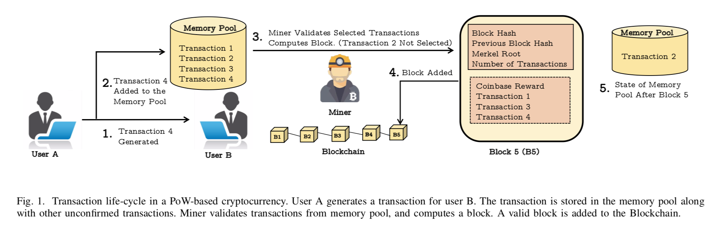  
#### 股权证明  
公共区块链中第二个最受欢迎的共识算法是股权证明（PoS）。引入PoS是为了解决PoW的能源效率低下问题。在PoS中，用户的挖掘能力由他拥有的代币总数决定。对于每个新块，进行拍卖以选择候选矿工。用户对块进行出价，并选择出价最高的那个作为矿工。因此，与PoW相比，散列功率被用户拥有的资产量所取代。用户拥有的代币越多，他赢得比赛的机会就越高。用基于股权的采矿取代能源密集型采矿，使PoS能够高效且安全地抵御大多数攻击（第V-B节）。与PoW不同，在PoS中，所有加密货币令牌都是在创建创世块之前发布的。因此，当开采新块时，它不会在系统中引入新代币。但是，矿工会因它的贡献而获得交易手续费。  
#### 实用拜占庭容错  
第三种最受欢迎的区块链共识协议称为实用拜占庭容错（PBFT）协议。 PBFT广泛用于私有和需要许可的区块链，与PoS和PoW相比，网络具有更强的信任模型。在PBFT区块链中，系统被转换为一组主节点和从节点。从客户端接收到事务并发送给其它活跃节点的节点将被选择出来成为主节点。执行过程分四个阶段进行，即预备，准备，提交和回复阶段。在预准备阶段，主节点将事务发送到所有从节点。在准备和提交阶段，每个从节点都会对事务进行签名，并将其与所有其他从节点进行交换。在回复阶段，所有从节点都将其响应发送到主节点。主数据库收集所有已签名的事务并将它们放在一个块中。在图2中，我们展示了PBFT区块链中的交易验证过程。请注意，与PoW和PoS相比，PBFT具有更高的消息复杂性。  
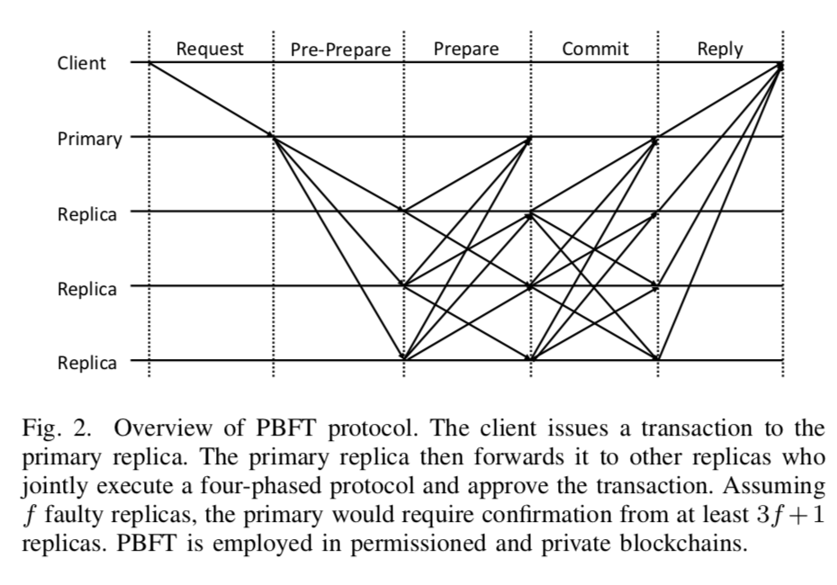  
在表III中，我们比较了区块链应用程序中使用的流行的一致性算法。请注意，无权限的区块链具有低吞吐量和高确认时间。比特币的交易吞吐量为每秒3-7笔交易。相比之下，许可的区块链有很高的优势  
图3.区块链中块的密码构造。请注意，前一个块的整个哈希值都会进入下一个块的头部。因此，如果攻击者对块的数据进行更改，则需要更改所有后续块中的数据并正确执行每个块的共识协议。由于这在实践中是不可行的，因此区块链被认为是防篡改的。  
  
吞吐量和确认时间短。在安全性方面，与PoW和PoS（≈50％）相比，PBFT具有低容错性（≈33％）。但是，由于许可的区块链具有更强的信任模型，因此它们不易受到对抗性攻击。在表III中也可以观察到，公共区块链比私有区块链更具可扩展性。这可归因于事务验证中涉及的消息复杂性以及拜占庭节点的容错。由于PBFT具有高消息复杂性和低拜占庭容错性，因此它不能很好地扩展到超过几百个节点。因此，每个共识方案都有其自身的好处和局限。因此，可以根据应用模型，选择相应的一致方案来满足要求。  
  
### B. 区块链结构  
虽然区块链中的共识方案可能有所不同，但区块链的加密结构在所有应用中基本相同。区块链中的每个块由标头和有效负载组成。标头包括主要信息，例如前一个块的散列，默克尔树根和块时间戳。散列指针将每个块连接到前一个块，从而形成链。由于哈希函数是单向的并且是抗冲突的，因此区块链从它们的属性中获益，变得不可变和防篡改。在图3中，我们说明了Blockchain的这个模型，其中块通过散列函数链接。  
  
在区块链应用程序中，所有节点都以对等体系结构连接。这意味着他们使用Gossip协议来传递信息，包括事务和块。理想情况下，每个对等体都应该保留区块链的副本。但是，由于追加模型，区块大小的不断增加会导致节点存储空间捉襟见肘。为了解决这个问题，各种区块链应用程序允许将节点分割为全节点和轻节点。全节点维护区块链的完整副本并参与事务和块传播。另一方面，轻节点仅保留块头以验证新发布的块。  
如前所述，对区块链的一些攻击与区块链本身的构造、某些矿工的行为以及它所构建的点对点架构有关。在随后的章节中，我们将探讨与区块链结构相关的可能攻击，与区块链系统中使用的对等架构相关的攻击，以及与使用区块链技术的应用服务相关的攻击（即比特币或以太坊）。我们还为每个部分补充了为研究人员解决这些攻击而提出的可能性对策。  
## IV. 区块链结构攻击  
在本节中，我们将研究与区块链的设计结构相关的攻击。这些攻击来自区块链结构的潜在漏洞，因此，它们可以危害任何基于区块链的应用程序。  
### A. 区块链分叉  
分叉表示网络中的节点对于长时间持续甚至无限期持续存在的区块链状态的分歧视图的情况。这些分支可能是通过协议故障或客户端软件升级不兼容而无意产生的。分叉也可能由恶意意图引起，例如植入遵循相互冲突的验证规则的“女巫节点”或在竞争条件下进行“自私挖矿”，如第V-A节中进一步讨论的那样。当区块链应用程序的用户从父应用程序创建子应用程序时，会发生另一种形式的分支。例如，在2017年，一群比特币开发商决定通过开发一个能够接受8MB块的新比特币客户端，将块大小限制从1MB增加到8MB。然而，他们的提议未被大多数用户接受，因此，他们在比特币上创建了一个硬分叉并发布了一种名为Bitcoin Cash的新加密货币。比特币现金是比特币的子应用程序，有新的规则和规定。因此，还可以创建分叉以启动新应用程序。  
故意的分叉可以是软的也可以是硬的，后者在网络接受的新块被预分叉节点校验无效时发生。但是，当某些块对已分叉节点校验无效时，会出现软叉。在任何一种情况下，区块链分叉代表一种不一致的状态，可被对手利用以导致网络内的混乱、欺诈交易和不信任。  
图4演示了一个硬分叉示例，该示例来自那些遵循区块链状态有关的冲突规则的节点。这种硬叉可能会导致加密货币的分裂。比特币的主要硬分叉在2017年8月发生，导致了比特币现金的产生。比特币的另一个硬分叉发生在2017年10月，当时比特币黄金创建。比特币中的其他一些值得注意的叉子包括比特币经典，比特币XT和比特币无限。但是，由于用户群和矿工不足，他们无法成为单独的加密货币。  
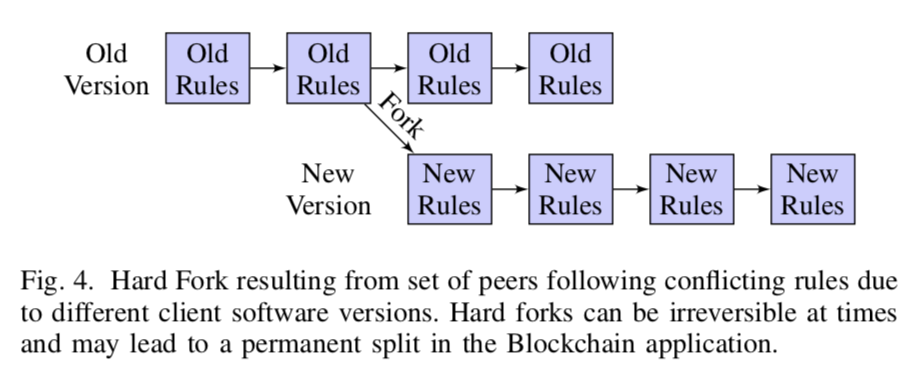  
当黑客窃取了“The DAO”所拥有的数字现金总量的三分之一以上时，以太坊使用硬分支来回滚交易并取回价值数百万美元的以太币（以太坊网络的“燃料”） 。但是，这需要网络中的大多数节点达成共识。  
在这种情况下，如果由于多数攻击或DDoS事件而发生共识延迟，则欺诈活动变得难以处理，并且长时间延迟最终可能导致加密货币贬值。 2017年11月，比特币提出了第二版隔离见证（SegWit2x）硬分叉，旨在将块大小增加到2MB。然而，由于多数人缺乏共识，计划中的硬分叉被取消。在时间轴1中，我们提供了比特币的主要分叉列表。这些分叉是由一群矿工引入新规则和一些节点转向这些规则而产生的。所有这些分叉都引入了新版比特币。这里，我们注意到，如果同伴停止遵循新规则并切换回旧规则，分叉可能会减少。在隔离见证分叉中见到这样的例子，最初，一个网络对等阵营切换到比特币的隔离见证版本，然而，当他们在抗议中回到旧版本时，分叉结束。  
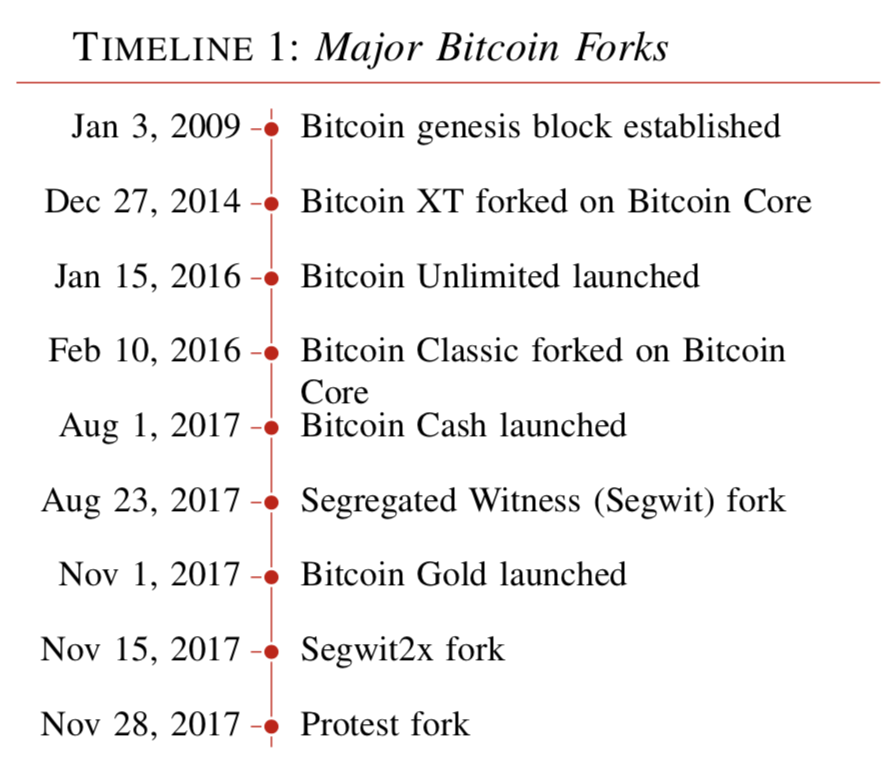  
### B. 旧块和孤块  
共识过程可能会出现两种形式的不一致，这些过程可能会将有效区块留在区块链之外。第一种形式是“旧块”，这是一个成功开采的块，但在当前最好的区块链（即最难重建的链）中不被接受。由于竞争条件，旧块主要出现在公共区块链中。在竞争条件下，矿工积极尝试寻找下一个区块，两个或多个矿工可能会提出有效的区块。网络最终接受其中一个获胜区块并丢弃其余区块。因此，未接受的所有其他有效块将变为旧块，因为它们未连接到主区块链。我们将在第V-A节中看到，一种被称为“自私挖矿”的区块链攻击形式也可能导致网络中的旧块的产生，这剥夺了一个诚实的矿工的奖励。  
另一种形式的不一致是“孤块”：一个块，其父块的哈希字段指向与区块链分离的未验证的块。这些不一致可能是攻击者引入的，也可能是矿工工作中的竞争条件造成的。大多数网络最初可以接受旧块，但是当接收到块是不连接到较长区块链（当前最佳链）时，可以拒绝它们。  
图5展示了可以找到旧块和孤块的链。  
  
比特币中的第一个孤块于2015年3月18日被发现，这是大多数孤块被创建时期的开始。这一趋势在2016年有所减少，从2017年6月到本文发表之日，没有孤块被添加到列表中。更常见孤块，是在平均出块时间更短的加密货币中。 在图6中，我们绘制了从2016年7月到2018年5月在比特币和以太坊中发生的孤块的数量。  
  
在以太坊中，孤块称为叔块。 使用min-max归一化对图中的数据进行归一化，以缩放[0,1]范围内的数据  
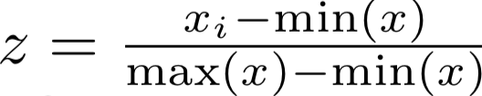  
从图中可以看出，max（x）-min（x）  
2017年6月，在比特币中没有发现孤块。另一方面，在以太坊中，自2017年11月以来叔块增加了。  
在诸如以太坊和比特币之类的加密货币中，难度是衡量计算块所需时间的度量，其由网络设定的目标值定义。基于散列功率，调整目标以将块时间保持在预定范围内（比特币为10分钟，以太网为12秒）。基于散列功率和一系列先前块所花费的时间来重新计算难度：如果散列功率增加，则在预期时间内找到块的概率增加。  
  
为了调整概率，通过增加目标值来提高难度。在（1）中，我们展示了计算块E（T）的预期时间如何随着网络Hr的难度D和哈希率而变化。这里，E（T）以秒为单位测量，D是求解当前目标所需的哈希数，Hr以哈希/秒为单位测量，目标设备可以在给定的字符串上产生。 Hr是所有矿工的总哈希功率Hi i = 1,2，...，n。在（2）中，我们计算时间Tb（秒），在给定由网络Tn设置的固定块时间的情况下，Hi中的单个矿工计算块需要时间。对于比特币和以太坊，平均块计算时间Tn分别为600秒和12秒。  
从公式（1）可以看出，当Hr保持恒定并且难度D减小时，预期的阻塞时间E（T）减小。直观地，较低的E（T）意味着在定义的网络时间Tn中，将产生更多的块。但是，在区块链中，只能接受一个区块。这种情况将导致系统中出现更多的孤块。在图7中，我们绘制了以太坊中的难度，哈希率，块时间和孤块（也称为叔块）。  
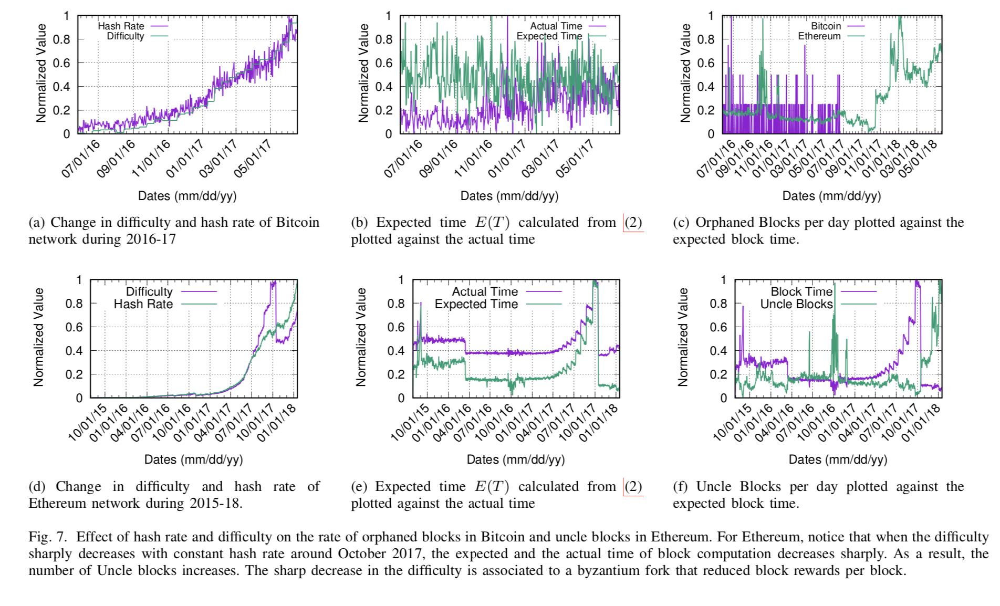  
在图7中可以注意到，随着预期的块时间（公式（2））减少，孤块和叔块的数量增加。在以太坊中，由于短的出块间隔增加了块冲突的可能性，因此这种趋势很高。由于块传播中的不可预测的延迟，也可能发生孤块。由于网络流失和传播延迟，有效块可能无法到达大多数网络对等体。相比之下，竞争块能够轻松地通过网络传播并被大多数人接受。因此，网络行为和延迟分布也可能影响区块链系统中孤块的数量。  
### C. 共识机制中的脆弱性  
#### 1）工作证明：  
加密货币中使用最广泛的共识协议是工作量证明（PoW），它可以作为计算有效块的努力的证据。如（1）中所概述的，用于计算块的努力可以表征为满足由网络设置的难度参数D所需的散列的数量。随着网络Hr的聚合散列功率增加，提高了难度以将标准块时间Tn保持在定义的范围内（比特币为10分钟）。  
在7（a）和7（d）中，我们分别显示了比特币和以太币的难度和总哈希率的增加。由于PoW中的采矿是基于彩票的系统，矿工使用具有高哈希率的复杂硬件来增加他们中奖的机会。在所有基于PoW的加密中，比特币具有最大的哈希率。特别是，自2010年以来，比特币矿机已从2011年的中央处理单元（CPU），图形处理单元（GPU）切换到2012-13年的现场可编程门阵列（FPGA），并从2014年至今最后转向专用集成电路（ASIC）芯片。我们在表IV中展示了比特币硬件的这种演变以及散列率。  
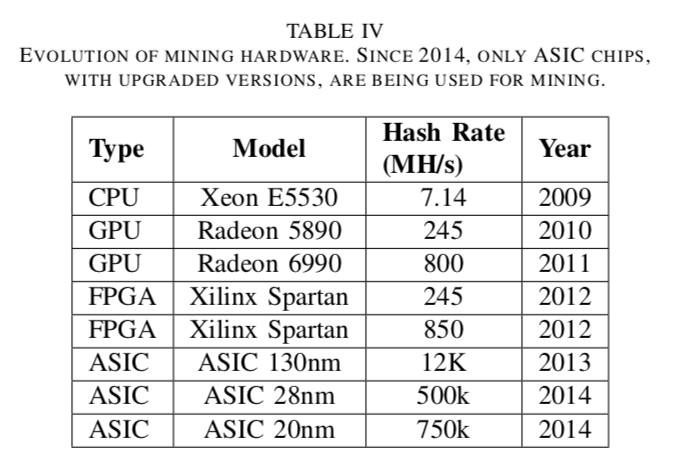  
PoW的一个主要问题是为找到有效的哈希值而过度浪费能源。目前，比特币和以太坊分别每年使用71.12太瓦时和4.2太瓦时（TWh）的电力来找到PoW所需的有效的哈希值。在图8中，我们显示了与几个国家相比比特币的电力消耗。  
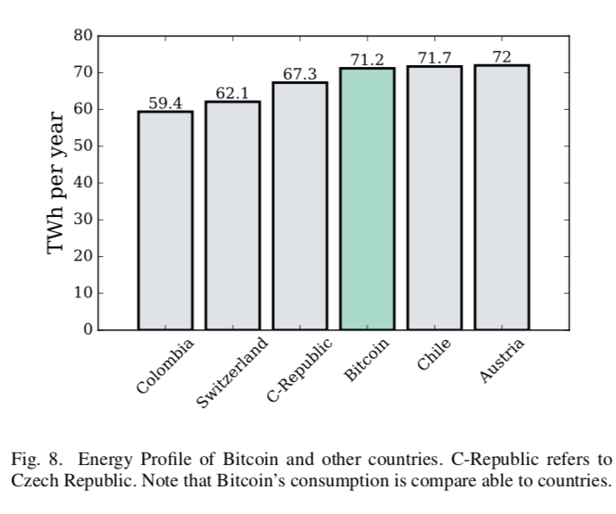  
除了过度消耗电力之外，一些矿池中的散列率集中化使得区块链应用易受攻击，包括51%攻击和双重支出（在V-B和第VI-B节中讨论），如果是矿工获得网络中大部分的哈希率，矿工将能够获得对系统的控制权。  
#### 2）PoS：  
（PoS）由King和Nadal在2012年引入，使区块链应用更加节能，并提高了多数攻击的成本。与基于彩票的PoW不同，PoS使用基于抵押的确定性方法来选择验证器并发布新的块。在这种方法中，验证者由投标过程选择，由此候选验证者对其投注进行投标。赌注是候选验证人拥有的余额，用于阻止系统中的作弊。选择出价最高的候选人开采下一个区块，如果他试图用虚假交易欺骗系统，他可能会失去他提交的抵押（余额）。由于在每个投标过程之前选择了验证器，因此该过程是确定性的。因此，块在其预期时间内发布而没有时间偏差或延迟。此外，为了对基于PoS的加密货币发起多数攻击，攻击者需要获得超过50％的加密货币令牌。虽然在PoW中获得50％的哈希率相对容易，但很难获得50％的硬币。因此，与PoW相比，在PoS应用中发起多数攻击的成本相对较高，这使得攻击不太可行。  
尽管PoS是PoW的“绿色”采矿替代品，并且提高了大多数攻击的攻击成本，但它有一些突出的问题阻止了区块链社区对它的广泛采用。在PoS中，富有的验证器可以继续赢得下一个要验证的块的出价，并累积块奖励。因此，系统中的富有验证器可以更加频繁地进行块确认，这使得PoS应用程序在这些验证器周围变得中心化。这挑战了区块链技术作为分散系统的基本前提。此外，与PoW不同，资源有限的矿工可能仍有机会赢得彩票，PoS中的小投标人肯定会失去对每个即将到来的区块的出价。  
#### 3）PBFT：  
如第III-B部分所述，在基于PBFT的私有区块链中，系统被分组为<u>一组复制品</u>，处理交易并助推块的形成。主节点负责订阅事务并从其他节点获取批准。一旦收到足够的批准，主节点将计算块并将其广播到网络。 PBFT被认为是具有高交易吞吐量和高能源效率。但是，它的工作原理是主副节点忠实地执行协议并且不会篡改事务和块的排序。这种假设可能会导致许可区块链中的漏洞。如果主节点被泄露，它可能：  
1）放弃从其他节点获得的批准并过早中止执行，  
2）重新排列事务序列以延迟验证过程和块生成，  
3）保留与其他节点的交易或块，或者全部，  
4）即使在获得批准后，交易也会失效。  
因此，私有区块链始终面临可能危及系统的恶意主节点的风险。但是，由于每个人通常都知道主节点的身份，因此最终可以追踪主节点的恶意活动。  
基于PBFT的私有区块链的另一个关键挑战是其有限的可扩展性和对拜占庭节点的低容忍度。低可伸缩性源于与单个事务处理相关的O（n2）消息复杂性，如图2所示。在PBFT中，事务执行分四个阶段执行，即预备，准备，提交和回复。在准备和提交阶段，每个对等体都需要向网络中的每个其他对等体发送消息。总的来说，这会导致巨大的通信开销，而这种开销无法在大规模应用上有效地发挥作用。因此，当网络规模增大时，PBFT的性能显着下降。这是基于PBFT的私有区块链遭受低可扩展性的关键原因。  
最后，基于PBFT的私有区块链的另一个限制是它们的低容错性。每个事务都需要3f + 1个副本的批准，其中f是有缺陷的节点或拜占庭节点的数量。与PoW和PoS（网络可承受高达50％的恶意实体）相比，PBFT只能容忍33％的恶意节点。如果PBFT已经具有低可扩展性，则较低的容错性增加了攻击者将恶意节点放置在网络中的机会。目前，比特币有超过10,000个活跃的完整节点。这意味着它可以容忍多达5,000个故障节点。损害5,000个节点的成本很高，因此攻击是不可行的。但是，在由100个节点组成的基于PBFT的私有区块链中，攻击者只能通过控制33个节点来成功。低容错是基于PBFT的区块链应用中的主要挑战。  
考虑到现有共识算法的特征和缺点，需要新的安全、可扩展和节能的共识机制。目前，这仍然是一个活跃的研究领域，最近在这方面取得了一些显着进展。  
### D. 对抗区块链结构攻击  
在区块链网络中解决软分叉是一个相对简单的过程，网络中的所有同行都可以就区块链的真实状态达成共识，并从那里恢复活动。解决硬分叉可能具有挑战性，因为冲突链可能很长，交易活动可追溯到冲突发生时期。虽然从硬叉回滚的利害关系很高，但它们可以通过前面讨论的相同的共识原则来解决。与以太坊的情况一样，在“DAO”遭到攻击后，硬分叉被用来为投资者取回钱。最终，解决分叉的过程取决于网络中对等方的协议以及它们在分叉中占有的份额。  
在以太坊中，叔块也会获得奖励并成为区块链的一部分。最近，由于采矿网络的变得越来越集中，比特币中的孤块数量减少，从而降低了分散式网络中普遍存在的孤立块的可能性。然而，集中式挖掘还存在其他问题，例如网络中的不公平性和51％的攻击。避免旧块或孤块的另一个解决方案是动态调整网络难度。在比特币中，难度每两周调整一次（2016个区块）。与此同时，如果网络的哈希率急剧增加或者更多的矿工加入，那么找到新块的预期时间会减少。结果，产生旧块的可能性更高。因此，动态难度调整有助于减少旧块和孤块的数量。尽管存在有效的技术来对抗分叉和孤块，但共识领域仍然存在。研究工作需要致力于使PoW更加节能，PoS更加分散。在基于PBFT的专用区块链中，关键问题是由于高消息复杂性而导致可扩展性有限。此外，PBFT具有低容错性，使其易受攻击。在第V-H节中，我们提供了有关使PBFT更具可扩展性和安全性的更多详细信息。  
## V. 区块链对等系统  
底层对等体系结构是区块链提供某些保证的主要原因，包括安全性和可访问性。与直觉相反的是，区块链所在的这种点对点架构实际上会导致多种攻击，包括自私挖矿，51％攻击，DNS攻击，分布式拒绝服务攻击，日蚀攻击，扣块攻击和共识延迟。在本节中，我们将探讨这些攻击如何破坏区块链应用程序。  
### A. 自私挖矿  
自私挖矿是某些矿工选择的策略，他们试图通过刻意保持他们的区块私有来增加他们的回报。这些自私的矿工不是在发现区块后将其公开传播，而是继续开采他们自己的私人区块以获得比公共区块链更长的链条。这些活动导致诚实矿工的公共链与自私矿工的私链之间的竞争。一旦公共区块链开始接近其私链的长度，自私的矿工就会释放他们的区块以获得大量奖励。拥有卓越的采矿力量可能会进一步帮助自私的矿工赢得大赛。在图9中，我们演示了如何进行自私的挖掘攻击。  
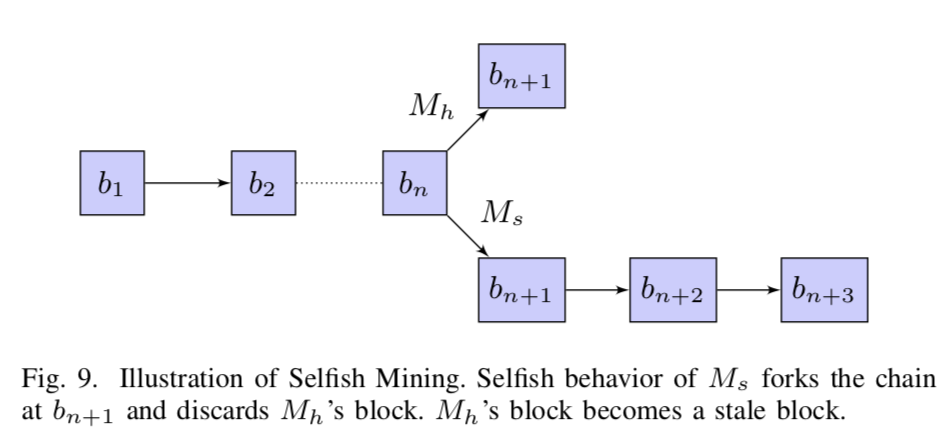  
考虑带有块的区块链（b1，b2，...，bn）。假设一个诚实的矿工Mh成功挖掘了下一个区块bn + 1并且他发布了它。网络中的所有对等方都验证并接受它的区块。与此同时，一个自私的矿工Ms也会计算块bn + 1。Ms选择扣留它并成功地再挖掘两个街区bn + 2和bn + 3，而不是发布区块。尽管Mh的区块被添加到区块链中，我们仍然表明Mh仍然可以被欺骗，同时网络对他的区块充满信心。令Mh的块bn + 1的哈希值低于目标阈值和Ms的块bn + 1。如果只有这两个块被呈现给网络，则将选择Mh的块（由于其更大的计算复杂性）而不是Ms块，并附加到公共区块链。  
然而，经过一段时间后，Ms释放了他所有的块bn + 1，bn + 2和bn + 3，并在bn + 1处分叉区块链。由于区块链的设计协议，网络将转移到属于Ms的较长链并丢弃Mh的块bn + 1。由于Ms的自私行为，Mh在计算它的区块所做出的努力将被浪费。采用这种自私挖掘策略的动机是通过发布更长的链条来最大化块奖励。应该注意的是，从区块链中排除Mh的块bn + 1不会破坏块，而是导致网络中另一个重要问题，如IV-B部分所示的“旧块”。  
自私的采矿攻击可以通过使为区块链做出贡献的诚实矿工的区块无效，从而对网络的其它部分产生不良后果。此外，诚实矿工块中的所有交易也会被拒绝。在两个自私的矿工竞争将他们的链条添加到网络的情况下，“区块链分叉”的可能性出现（在IV-A部分）。这些分支可能导致网络中的共识延迟，这可能进一步导致其他潜在的攻击，例如“双重支出”和“<u>扣留后分叉</u>”，如第VI-B节所述。网络中的一种自私活动有可能破坏整个网络，因此必须研究它们之间的关系。  
### B. 多数攻击  
大多数攻击也被称为51％攻击是基于区块链的应用程序中众所周知的漏洞，当单个攻击者，一组女巫节点或网络中的矿池获得网络的大部分哈希率时，可以利用这个缺陷操纵区块链。对于大多数网络的哈希率，攻击者能够  
1）防止事务或块被验证（从而使它们无效），  
2）在它们控制期间进行逆转交易以允许双重花费，  
4）分叉主链并拆分网络，  
3）防止其他矿工（验证者）在短时间内找到任何区块。  
在竞争条件下，具有超过50％哈希率的攻击者可以保证超过其它矿工，并且很可能将它们的区块附加到区块链中。此外，这些块可能具有欺诈性或双重性交易。例如，如果攻击者执行交易以换取任何带有Alice的产品，它可以复制与Bob相同的事务并将其放在块上。区块链上的交易是不可逆的，只有一个交易可以被认为是有效的。在下文中，我们详细阐述了多数攻击的双重支出以及数学原语的前景。  
#### 1）注意事项和现实：  
矿池并不总是需要51％的网络散列能力来进行欺诈活动。因此，即使具有较少的散列能力，也可以以很大的成功概率实现类似的目标。要了解此问题，请考虑如果一个具有显著哈希率的恶意矿池与接收方执行事务Tx的同时，它从同一个父事务中生成欺骗性的双重花费事务Ty以欺骗接收者。另一方面，接收器在将产品释放给矿工之前等待k确认。 k个确认意味着在挖掘出事务Tx之后的网络已经挖掘了k个后续块。在此过程中，恶意矿工使用双重花费的交易Ty继续挖掘矿块，并希望在收到来自收件人的产品后分叉区块链。通过分叉链，恶意矿工将能够包含事务Tx的链无效，并将其替换为具有双重花费事务Ty的链。  
为了发起成功的攻击，恶意矿工需要发布具有有效PoW的更长链，以便网络切换到它的分叉版本。矿工的成功取决于它的哈希率x作为网络哈希率的一小部分和确认数量k。为了找到攻击者成功的概率P（s），令x为矿工散列能力的分数，y为剩余散列能力的分数，其中x + y = 1。成功概率是：  
  
#### 2）数值结果：  
在图10中，我们展示了P（s）如何随着不同的哈希率而变化。  
  
请注意，如果矿工获得网络哈希率的一半，他可以100％的成功率欺骗收件人。此外，哈希率低于50％的攻击者仍然可以成功分叉主链并欺骗接收者。  
#### 3）应用和含义：  
基于区块链的物联网（IoT）应用程序，被称为“缠结”，理论上可以用三分之一的散列能力进行攻击。巴哈克等人表明，大多数攻击是高度可行的，四分之一的网络散列能力。有一些在线服务，如Nicehash，每小时向矿工租用哈希能力。  
恶意矿池可以将计算能力租用几个小时，并对目标加密货币发起多数攻击。由于主要区块链系统具有较高的聚合哈希率，因此对其发起51％攻击的租赁成本（自然）很高。在表五中，我们根据从“51crypto”获得的数据概述了前六大基于区块链的加密货币，以及成功启动51％攻击所需的成本。  
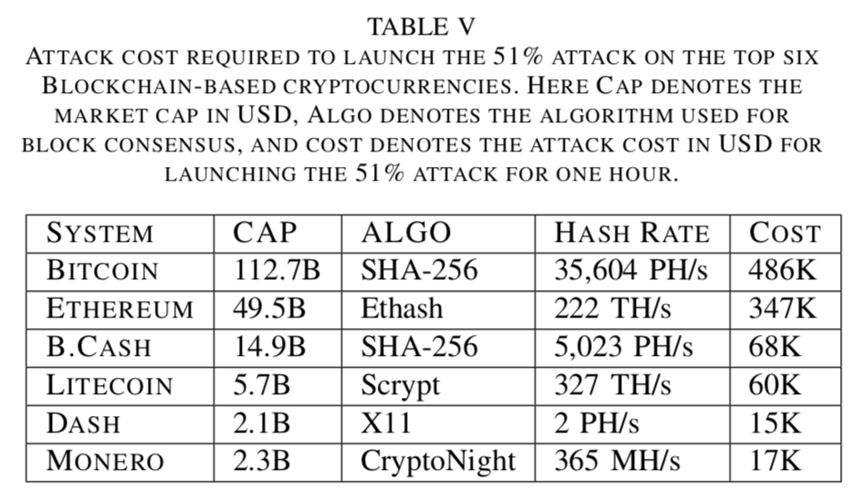  
我们注意到，市值为23亿美元的Dash可能会因为仅花费17,000美元（占市值8 × 0.0001%）而在一小时内受到损害。  
#### 4）案例研究：  
51％的攻击并非超出可能性范围。 2014年7月，比特币矿池“GHash.IO”获得了超过51％的哈希率一天，这引起了媒体和媒体对比特币及其脆弱性的许多关注，并揭示了在基于比特币的系统中的一般性问题。虽然没有进行任何恶意活动，但是当矿工离开矿池并于2016年10月最终关闭时，“GHash.IO”的规模缩小。2016年8月，一群被称为“51 crew”的袭击者劫持了两个以太坊区块链，即Krypton和Shift，并通过双重支出成功劫持了21,465个Kryptons数字货币。 2018年5月，一群恶意矿工在比特币黄金获得了51％的哈希率，并偷走了价值1800万美元的加密货币。 2018年6月，其他四个着名的基于区块链的加密货币也受到攻击;即Monacoin，Zencash，Verge和Litecoin Cash。  
### C. 网络攻击  
区块链应用程序是分散的，并使用对等网络架构作为网络实体之间的通信媒介。在本节中，我们将研究与对等网络相关的攻击，我们将使用比特币网络作为示例来提供这些攻击的详细信息。与区块链网络相关的攻击包括DNS攻击，空间分区和日蚀攻击。对于这些攻击中的每一种，攻击者的目标是将用户和矿工与真实网络隔离，限制他们对网络资源的访问，或在网络中创建分区并在对等体之间强制执行冲突规则。  
#### 1）DNS攻击：  
当节点第一次加入比特币网络时，它不知道网络中的活动对等体。要发现网络中的活动对等体（由其IP地址标识），需要引导机制。域名系统（DNS）可以用作引导机制，并且在加入网络时节点查询DNS种子以获得关于其它活动对等体的进一步信息。初始DNS查询返回一个或多个DNS A记录及其对应的接收传入连接的对等体的IP地址。一旦新节点建立与对等体的连接，它就可以发送带端口号的addr命令以建立与其他对等体的连接。  
在比特币系统开发者指南中已经提到，DNS通常会为比特币网络打开广泛的攻击面。也就是说，DNS解析容易受到中间人攻击（在解析器端），缓存中毒和陈旧记录等许多其他攻击。对于此攻击，攻击者可以在开源区块链软件中注入无效的种子节点列表，或者在解析器对DNS缓存投毒。默认情况下，区块链软件客户端具有允许网络发现的种子列表。如果攻击者注入了一个虚假的种子列表，则该用户将受到攻击。因此，对手可能会潜在地隔离区块链对等体并导致它们进入假冒网络。在图11中，我们说明了如何通过中毒DNS缓存来执行DNS攻击。  
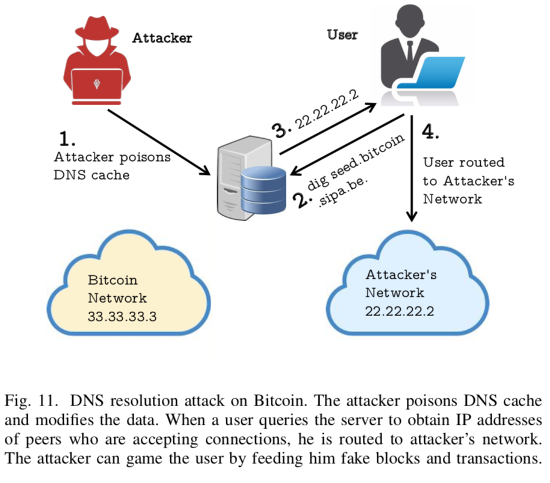  
比特币网络中的节点具有33.33.33.3的IP地址（举例说明），而伪造网络中的攻击者节点具有IP地址22.22.22.2。攻击者投毒DNS缓存以诱使用户进入伪造网络。用户进行DNS查询dig seed.bitcoin.sipa.be，不是响应33.33.33.3，DNS解析器返回22.22.22.2。结果，用户连接到伪造网络中的恶意节点，并且恶意节点可能向用户发送假块。有关DNS安全性的更多信息，请参阅其它相关工作。  
#### 2）BGP劫持和空间划分：  
大多数区块链应用中有两种类型的节点，即完整节点和轻量级节点。完整节点是网络中的实际参与者，负责中继块和交易以及维护区块链的更新副本。轻量级节点不维护区块链，仅使用完整节点的服务来访问网络。由于轻量级节点从完整节点中获取区块链的视图，因此当完整节点被破坏时，其所有关联的轻量级节点也会受到损害。区块链网络中的完整节点在互联网上的空间分布，在表VI中，我们显示了三个主要比特币系统（加密货币）中完整节点的空间扩展。  
  
在每个系统中，大多数节点位于美国，德国，中国和俄罗斯。互联网上的流量流由互联网服务提供商（ISPs）控制，互联网服务提供商拥有一个或多个自治系统（ASes），负责处理流量路由。  
节点在AS或ISP空间内集中使其容易受到BGP路由攻击。AS可以劫持承载大多数区块链应用程序节点的目标AS的流量，这可以破坏有价值信息（包括事务和块）流向目标AS托管的节点。当受害者节点是矿工或矿池时，攻击者可以大大降低区块链应用程序的哈希率，从而影响系统活动。在矿池中，矿工使用StratumServer协议进行通信。StratumServer充当了矿工提交PoW的入口。 StratumServer具有公共IP地址，使其易受路由攻击和泛洪攻击。 Apostolaki研究说，通过在比特币中劫持少于100个边界网关协议（BGP）前缀，攻击者可以隔离高达50％的网络哈希率。他们进一步探讨了60％的比特币流量只遍历三家互联网服务提供商（ISP）。每个月，超过100个比特币节点遭受路由攻击和BGP劫持。此外，他们估计路由攻击可以将块传播延迟最多20分钟。如第IV-B部分所述，比特币的平均块计算时间为10分钟。因此，路由攻击可以将两个或更多个块的传播延迟到一组节点。这种延迟增加了其他攻击的可能性，包括区块链分叉，共识延迟和双重支出。  
为了验证他们的结果并进一步分析比特币网络的空间脆弱性，我们复制他们的研究并注意到比特币网络在AS和ISP方面进一步集中。我们从“Bitnodes”中抓取数据，这是一种在比特币中维护与完整节点相关的信息的在线服务。在图12中，我们绘制了世界上跨AS和ISP的完整节点的空间分布的CDF。  
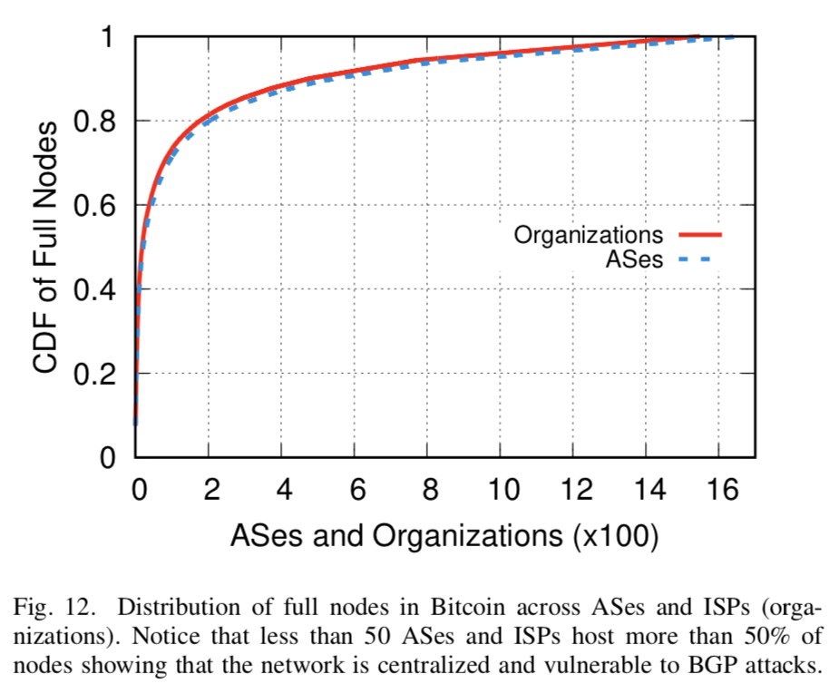  
在表VII中，我们显示了比特币中跨AS和ISP的矿池分布。  
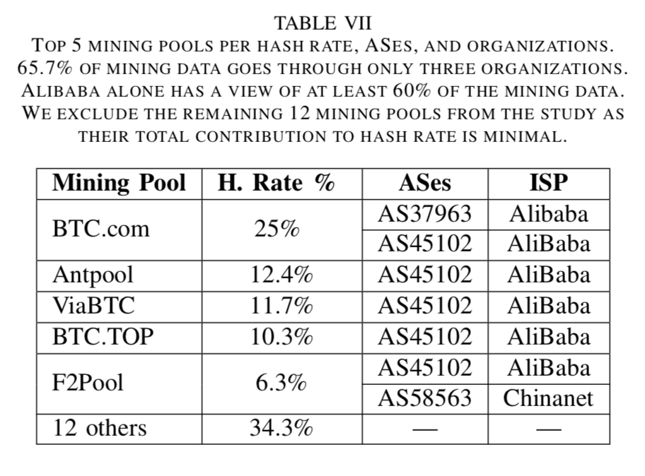  
请注意，60%的哈希率完全可被阿里巴巴截获。我们的结果表明，与Apostolaki等人的先前工作相比，比特币网络进一步集中化，变得更容易受到路由攻击。  
##### 实例探究  
在过去几年中，针对托管挖掘池或加密货币交换的AS发起了许多BGP攻击。 2014年，加拿大的恶意ISP公布了属于主要ISP的BGP前缀，包括亚马逊，OVH，数字海洋，LeaseWeb和阿里巴巴，并拦截了路由到矿池的流量。结果，攻击者赚了83,000美元。在2018年4月，针对MyEtherWallet.com发起了BGP攻击，MyEtherWallet.com是一个用于在线交换以太网令牌的开源Web应用程序。攻击者设法从网络应用程序中窃取了152,000美元。  
#### 3）日蚀攻击：  
区块链的点对点系统也容易受到一种称为日蚀攻击的攻击，其中一组恶意节点使用IP隔离其相邻节点地址，从而减少其传入和传出的流量。例如，在比特币中，节点可以主动连接到网络中的所有其他节点，形成节点集群。在节点集群中，每个对等体都知道所有其它对等体的IP地址。如果群集中有足够的受损节点，攻击者可以隔离诚实节点并更改其区块链视图。它可以控制它们的传入和传出流量，并向他们提供有关区块链和交易的虚假信息。  
在图13中，我们说明了这种攻击过程。  
  
只要诚实节点与另一个诚实节点保持连接，就很可能收到正确的信息以维持区块链的真实状态。然而，当诚实节点之间的连接受到损害时，它们将被恶意节点包围并变得容易受到日蚀攻击。当这些节点被伪造的事务和块充斥时，它们最终会产生错误的区块链状态视图，并成为恶意节点集群的一部分。此外，如果另一个诚实节点与恶意节点集群建立连接，它也会暴露于同一漏洞，从而导致虚假交易和块传播的级联效应。  
### D. 分布式拒绝服务攻击  
对在线服务的最常见攻击之一是分布式拒绝服务（DDoS）攻击。区块链技术尽管是一个点对点系统，仍然容易受到DDoS攻击。基于区块链的应用程序，如比特币和以太坊，一再遭受这些攻击。 DDoS攻击以多种方式表现出来，具体取决于应用程序性质，网络架构和对等体行为。例如，在比特币网络中，51％的攻击可能导致拒绝服务。具体而言，如果一组矿工获得了显着的哈希能力，它们可以阻止其它矿工将其开采的区块添加到区块链，使正在进行的交易无效，并导致网络中的服务故障。分叉如果恶意行为的结果，可能变成硬分叉，导致拒绝服务的类似结果。  
#### 1）压力测试：  
攻击的另一种可能性是由于区块链应用程序在给定时间内可以处理的每个块的事务数量有限。例如，平均而言，比特币网络需要10分钟来挖掘一个块，最大大小为1MB。虽然比特币交易的规模各不相同，但比特币交易的平均规模大约为500字节，平均每块大约允许2,000笔交易 - 据报道，在比特币中添加到块的最大交易数量为2,210 。此外，基于预定义的难度挖掘块所需的平均时间约为10分钟。因此，对于要成功包含在区块链中的网络中的所有当前交易，其数量不得超过每分钟200个交易。考虑到这一点，以及每个事务需要至少两个对等体（由两个不同的公共标识符标识）参与事务的事实，每分钟由网络服务的总活动对等体（比如包含其事务的块的位置）将被开采不会超过200个节点。鉴于这些限制，比特币的吞吐量是每秒3-7个事务。与Visa Credit等主流支付处理器相比，比特币的吞吐量较低，前者每秒可以验证多达2,000笔交易。  
攻击者可以通过引入女巫身份来利用比特币系统的上述操作现实，即同一个对手也可以控制多个钱包。此外，使用这些身份，攻击者可以在他控制的各种女巫身份之间发出几个粉尘交易（例如，每笔交易0.001 BTC）。通过在短时间内引入大量小值的交易，网络将因为创建包含那些交易的块而拥堵，并且将拒绝对网络中的合法用户提供服务。由于这种拥堵，对手也可能发动其它攻击：例如，双重花费由于拥堵而未被打包的令牌交易。  
有人可能会争辩说，矿工可能会选择在一个区块中包含哪些交易。然而，正如中本聪所概述的那样，比特币的设计不鼓励这样做。今天的区块甚至包括价值低至0.0001 BTC的交易，这使得网络充斥低价交易成为可能。  
#### 2）内存池泛洪攻击：  
另一种形式的DDoS攻击是在密码的内存池（mempools）上进行的，以增加采矿费用。如图1所示，mempools充当未经证实的事务的缓存。尽管加密货币的块大小有限，但是内存池没有大小限制。虽然，用户会计算内存池的大小以确定其事务的优先级。如果内存池中有更多交易，那么采矿竞争就会变得很激烈。为了优先处理交易，用户开始支付更多采矿费作为矿工的激励措施。萨阿特等人确定了对区块链应用程序的低成本DDoS攻击，其中攻击者和伪造的女巫节点可能会使未经证实的事务充斥内存池。这种攻击会使合法用户感到恐慌，这些用户在攻击者的交易没有被开采的情况下，倾向于支付更高的采矿费来优先处理他们的交易。结果，攻击者发起了DDoS攻击。  
#### 3）案例研究：  
在比特币中，恶意用户通过粉尘交易充斥着内存池，使合法用户支付更高的采矿费。 2017年11月11日，比特币内存池规模超过了115k未经证实的交易，导致价值7亿美元的交易失效。在2018年6月，内存池再次受到4,500起未经证实的垃圾邮件交易的攻击，这使得内存池的大小增加了45MB。规模的扩大导致采矿费激增，合法用户被迫支付更高的费用以开展交易。在图14中，我们绘制了过去两年中比特币的内存池大小和采矿费用。  
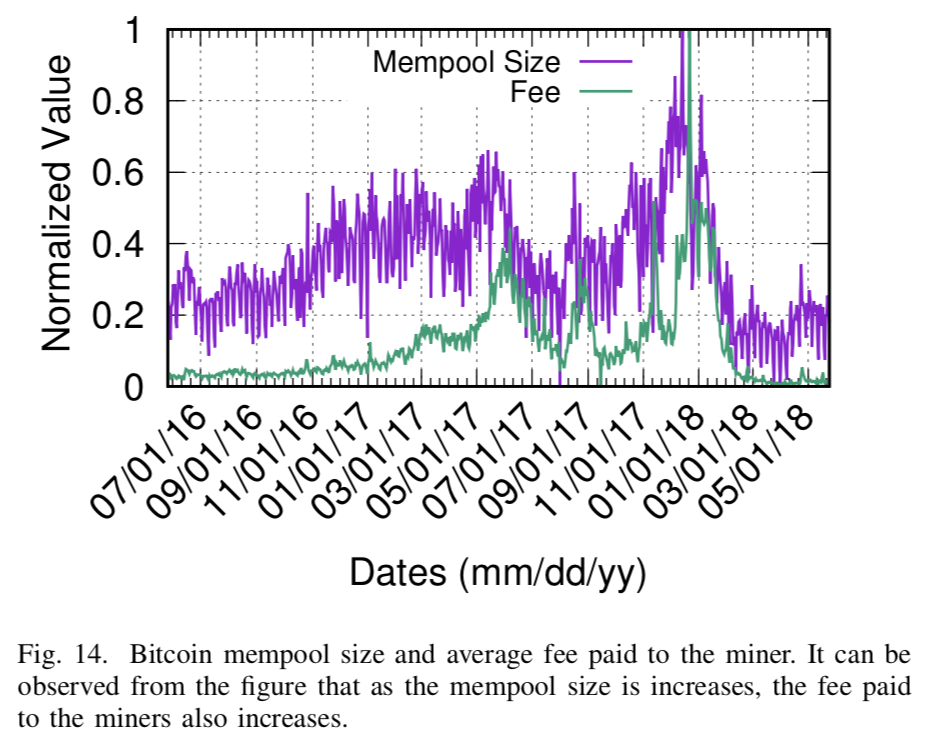  
我们使用min-max规范化来缩放数据点。  
#### 4）私有区块链中的DDoS攻击：  
在基于PBFT的私有区块链中，如果对手控制≈33％的副本，则可以发起DDoS攻击。在专用区块链中，参与节点知道网络的大小，这允许攻击者计算它需要在网络中引入攻击的女巫节点的数量。假设攻击者控制f女巫节点使得总网络大小为n <3f + 1，则攻击者将能够发起DDoS攻击以停止验证过程。对于主要发送的每个事务，女巫节点将不会回复其批准。由于主节点需要至少3f + 1个节点的批准，因此它将无法处理任何事务，系统活动将停止，从而导致DDoS攻击。  
在公共区块链中，发起这样的攻击可能代价高昂。攻击者需要拥有总哈希率的大部分，大部分赌注，或控制超过50％的网络同行。考虑到比特币等公共区块链应用程序拥有超过10,000个活动的完整节点，攻击者无法启动成功的攻击。另一方面，在私有区块链中，网络规模不会超过几百个节点，因此攻击者只需控制33％的节点或仅控制主节点，这使得对私有区块链的攻击更加可行。  
### E. 扣块攻击  
可以利用加密货币的对等网络来创建关于区块链的冲突视图。恶意节点可以故意掩盖，伪造或隐藏需要通过网络中继的重要信息。这种性质的一些已知攻击是“芬尼攻击”和“扣块攻击”。  
#### 1）芬尼攻击：  
芬尼攻击是双重支出攻击的变种，其中矿工延迟区块传播以使其交易倍增。矿工生成事务，计算块，并选择不中继块。与此同时，它生成了先前交易的副本并将其发送给收件人。在收件人接受交易并交付产品后，矿工将其原始交易中的前一个块发布到其中。因此，发送给收件人的先前交易变为无效，并且矿工成功双重交易。  
由于短块间隔和时间敏感的攻击程序，芬尼攻击的成功概率很低。比特币和以太坊的区块时间为10分、15秒。如果攻击者试图对以太坊发起此攻击，则他不太可能  
1）生成双重花费的交易，  
2）欺骗开放的接收者，  
3）在确认之前接收产品，  
4）在15秒内比其他矿工更快发布。  
由于攻击过程比块间隔时间更耗时，因此芬尼攻击非常不可行，因此，任何加密货币都没有报告过芬尼攻击的情况。  
#### 2）经典扣块攻击：  
对分散式矿池发动扣攻击，意图通过扣留有效的PoW来损害池操作员。在分散式矿池中，所有参与者消耗电力和CPU功率以找到其随块的散列值小于目标阈值的随机数。一旦找到有效的解决方案，所有参与者都将根据他们对计算解决方案的总体努力给予奖励。由于随机数发现是基于彩票的系统，因此，具有较少散列能力的矿工也可能在具有较高散列率的其他矿工之前提出有效的解决方案。在扣块攻击中，池中的自私矿工找到工作证明并选择不向池操作员公开。没有意识到自私矿工的存在，池中的其他矿工浪费了他们的资源来寻找现状并最终失去了出块竞赛。然后自私矿工可以与其他矿池共谋并与他们共享PoW以获得更高的回报，甚至可以使用不同的身份独立发布该块。由于池中一名矿工的这种不公平行为，整个矿池被剥夺了出块奖励。  
当两个挖掘池有意尝试分割区块链以创建网络分区时，可能会有另一种形式的扣块攻击。例如，在加密货币中有两个矿池，即MpA和MpB，MpA计算有效块但决定不发布它。 MpA等待MpB计算和发布块。一旦MpB发布其块，MpA也会释放其块并在网络中产生两个有效块。这将分叉区块链，并且在接收到两个有效块时，网络中的节点将达成共识意见不一致。此攻击不仅可能会对网络进行分区，但也可能导致两个矿池损失。因此，到目前为止，在任何区块链应用程序中都没有报告此类攻击。  
#### 3）扣块分叉攻击：  
另一种形式的扣块攻击被称为扣块分叉攻击（简称FAW）。据Kwon等人介绍，FAW总是比扣块攻击更有价值。在下文中，我们概述了FAW的攻击程序  
1）恶意矿工分别加入两个矿池MpA和MpB。   
2）矿工计算矿池MpA中的有效PoW。  
3）他保留解决方案并且只有在MpB也发布块时才发布块。   
4）网络选择两个中的一个块。   
5）恶意矿工无论如何都会获得奖励。  
Kwon等人还表明，如果两次或多次矿池相互发射FAW，那么较大的矿池将始终在竞争条件下获胜。因此，FAW的攻击总是比自私挖矿和扣块攻击更有利可图。  
#### 4）私有区块链中的扣块：  
在私有区块链中，主节点可以在收到来自其它节点的确认后启动阻止区块的攻击。私有区块链的工作假设主要区域将忠实地执行协议。此外，对抗模型假设攻击者控制所有其它节点中的错误节点的子集。但是，如果攻击者还控制主节点，则他可以保留所有其它节点的块和事务。如图2所示，主节点从客户端接收事务请求，并将事务发送到其它副本以获取其签名。最后，它在处理足够数量的事务时计算块。但是，如果主节点受到损害，它可以：  
1）扣留客户发出的交易并中止验证过程，  
2）通过将交易发送到更少的节点来延迟验证过程，  
3）接收签名并丢弃它们，  
4）计算一个块并将其从网络的其余部分中扣除。  
在每种情况下，主节点都可以启动预扣式攻击来危害系统并延迟事务处理。  
### F. 共识延迟  
与对等自然架构相关的另一个攻击是共识延迟，Geravis等人注意到了这一点，在此攻击中，攻击者可能会注入虚假块以增加延迟或阻止同行就区块链状态达成共识。在图15中，我们说明了在比特币中块传播期间发生的延迟。  
  
当节点A接收到块时，它对块进行认证并向其邻居（包括节点B）发送inv消息。如果节点B没有该块，则将getdata消息发送回A.当从B接收到getdada消息时，A发送块到B.一旦B有块，它也验证块并向其邻居发送一个inv消息。如图15所示，在真实性检查（v1（t）和v2（t））期间产生最大延迟。其他延迟包括消息和块的传输延迟和传播延迟。传输延迟受块和消息大小的影响，而传播延迟取决于节点之间链路的带宽。  
在这种情况下，可以通过传播过时的块或双重花费的事务在网络中引入有意的延迟。不知道过时块的节点将使用getdata消息进行响应，并且在接收到块时，它们将浪费时间进行验证。如果攻击者控制节点集群部分V-C中的一组女巫节点，则可能会在该集群中的合法节点之间添加显着的延迟。对于时间要求严格的应用，例如基于区块链的点对点游戏，需要在短时间内实现分辨，则问题进一步恶化。  
在基于PBFT的私有区块链中，对手也可以通过使用女巫节点导致共识延迟。如图2所示，事务处理的一个主要组成部分是参与节点之间的消息和签名交换。特别是，在准备和提交阶段，每个节点将其签名发送到每个其它节点。如V-D部分所述，如果对手控制超过33％的节点，他可以发起DoS攻击。另一方面，如果对手控制较少的副本，他仍然可以在事务处理中引起共识延迟。 女巫节点还可以在准备阶段和提交阶段期间向其它节点发送伪签名。由于每个节点都需要验证签名，因此伪造签名将导致额外的验证开销。如果女巫继续发送这样的签名，它们可以停止提交阶段的完成并最终导致应答阶段的延迟。因此，主节点将无法获得交易验证所需的批准次数。这将导致共识延迟并降低应用程序的吞吐量。  
### G. 时间劫持攻击  
在比特币系统中，例如比特币，完整节点维护一个表示网络时间的内部计数器。通过从相邻对等体接收版本消息ver并在引导阶段期间计算其中值来获得网络时间。如果所有相邻对等体的中值时间超过70分钟，则网络时间计数器自动恢复到节点的系统时间。这为可能连接到目标节点的恶意节点创建了攻击机会，如图13所示。在这种情况下，攻击者可以提供中值超过70分钟的不同时间戳。此外，以比特币为例，如果一个区块的时间戳超过网络时间120分钟，则节点拒绝该块。攻击者可以计算新块并将其时间戳设置在网络时间戳之前50分钟。然后，攻击者与女巫节点一起，可以通过对目标节点发起时间攻击来减慢目标节点的网络时间。因此，区块时间与目标节点计数器之间的差异将超过120分钟。结果，如果向目标节点传递块，则它将拒绝它和所有后续块。目标节点最终与主网络的活动隔离。  
### H. 对抗点对点攻击  
先前的研究已解决自私挖矿的问题，研究人员已经提出了几种可能的解决方案。 Solat和Potop-Butucaru提出了一个“生命周期”的块，以防止自私矿工扣块攻击。如果一个块的预期寿命到期（由诚实的矿工计算），它将被网络拒绝。 Heilman通过引入一种名为“Freshness Preferred”的防御计划来阻止自私矿工的盈利.Heilman建立在Eyal和Sirer之前的工作之上，通过向块添加不可伪造的时间戳，并且偏好与旧的相比具有更新更近时间戳的块。他的工作减少了自私的矿工长时间扣留他们的区块的动机。 Eyal模拟了两个挖掘池之间的游戏，进行了区块扣留并发现了矿工的困境，两个矿池均陷入余额损失。  
为克服区块链网络中的垄断而提出的反制措施也广泛讨论了多数攻击。米勒等人，建议改变比特币的PoW难题，以限制矿池联盟进行多数攻击。他们提出的设计在PoW中采用了非可外包的谜题，其中外包采矿工作的矿池可能会失去采矿奖励。萨阿特等人，利用预期的交易确认高度和块发布高度来检测基于PoW的区块链中的自私挖矿行为。利用这两个特征之间的关系，他们为每个已发布的块创建了一个“真值状态”，以便区分合法块和自私的块。同样针对51％的攻击，Bastiaan引入了“两阶段工作证明”（2P-PoW）的概念。 2P-PoW是一种连续时间马尔可夫链（CTMC）模型，它为矿工解决了两个挑战，而不是一个。 CTMC的各状态通过缩小对矿池中矿工的激励来防止矿池增加到超出惊人的规模。 2P-PoW通过外包其大部分哈希值或暴露池操作符的私钥来防止大型矿池创建霸权。  
约翰逊等人，提出了一种游戏理论方法来解决针对矿池的DDoS攻击。其他对策包括对发件人可以拥有的交易中的最小金额设置上限，或者增加块大小以适应更多交易。另一种方法是减少采矿区块的难度，以便可以开采更多的区块而不会浪费任何交易。这些命题中的每一个都有自己的困境。  
增加块大小可能还不够，因为强大的攻击者仍然可以通过生成粉尘交易来充斥网络。另一方面，降低难度将减少区块时间，但会增加系统中孤块的数量和区块链的整体大小。在撰写本文时，比特币和以太坊区块链大小分别记录为162 GB和450 GB。萨阿特等人，提出了基于收费和基于年龄的对策，以防止DDoS攻击区块链内存池。在他们的工作中，他们将事务过滤过程从矿池转移到了内存池。他们提出的对策可以优化内存池的大小并提高攻击者的攻击成本，同时有利于系统中的合法用户。  
为了防止基于DNS的攻击，已经进行了广泛的研究，以便为区块链系统配备DNS攻击防御。 Apostolaki等，提出了路由攻击的长期和短期解决方案。他们提出了路由感知对等选择，以最大化互联网路径的多样性，并限制攻击的有利位置。他们还提出了对等行为监控，以检查块传递中的突然断开和异常延迟。  
防止延迟攻击的其他解决方案包括用于消息传播的端到端加密。防止空间分区的另一种可能方法是通过因特网分散托管矿池和完整节点。如表VI所示。 50％的以太坊节点位于两个国家内，这使得它们容易受到国家对手的攻击。为了防止这种情况，必须在具有更高地理分布和网络多样性的云服务上托管新节点。我们在本文中探讨的维度鼓励在DNS和DDoS攻击方面对区块链技术进行更多研究。  
对抗扣块攻击，Schrijve等引入了激励兼容的奖励计划，该计划不鼓励恶意矿工对目标矿池进行扣块攻击。罗森菲尔德引入了一种蜜罐技术来吸引流氓矿工陷入“陷阱”，从而捕捉到那些扣块的矿工。 Bag和Sakurai提出了额外的激励措施，以寻找一个有效的区块解决方案，以防止矿工勾结。与他们之前的工作同时，Bag等人，引入了一项新方案，该方案将当前目标中的矿工隐藏起来，以模糊他们区分部分和全部PoW的能力。他们提出的解决方案还绑定了矿池运营商，以便将奖励公平地分配给获胜的矿工。  
可以通过在池操作员给予矿工的任务中引入经过时间限制的信标来抵消FAW的攻击。作为对每个分配的响应，矿工计算部分工作量证明并将响应发送到嵌入信标值的池操作员。几秒钟后，信标值会更新以捕获恶意矿工，如果他保留有效解决方案并稍后在网络中传播它。然而，作者还注意到这种解决方案在某些情况下可能并不实用，并得出结论认为FAW攻击仍然是研究界需要解决的问题。为了解决私有区块链中的安全问题，已经提出了几种PBFT protcol的变体。这些协议试图将容错性提高到33％以上并使用硬件辅助来检测恶意节点的行为。私有区块链中的关键挑战是限制可扩展性的高消息复杂性。因此，在小型网络中，攻击者可以轻松地破坏33％的节点。为了解决这个问题，刘等人，提出了一种可扩展的拜占庭共识，其具有硬件辅助秘密共享，这将PBFT的消息复杂性降低到O（n）。这可以用来构建可以承受各种形式攻击的大型私有区块链网络。  
  
## VI. 面向应用层的攻击  
区块链和关联的对等系统与使用它们的应用程序服务分开。 根据区块链应用程序的性质，它们有自己的漏洞和攻击面。 因此，我们预计会有大量与各种应用程序相关的攻击，我们将在本节中介绍这些攻击。 我们的分析主要是关于加密货币和智能合约等应用。  
### A. 区块链隐私问题  
公共区块链具有弱匿名性，它们为公众提供开放的数据访问。因此，对公共区块链的分析可以向对手揭示有用的信息。此过程称为区块链数据挖掘，它可能不适合区块链应用程序或其用户。例如，开放市场中的信用卡公司可以使用数据分析来深入研究区块链上的公共信息，并优化自己的方案以与数字货币竞争。为了证明对公共数据的潜在利用，Fleder等人使用图分析在比特币的区块链数据和钱包用户的相关身份之间创建有向链接。  
#### Mt.Gox事件  
2013年，两名攻击者利用比特币区块链的公共性质进行欺诈性交易，并在多个交易所创造虚假的比特币需求。攻击的主要目标是Mt.Gox，2013年日本最大的比特币交易所。袭击者经常在Mt.Gox进行一系列欺诈交易，由于区块链是公开的，交易率也被其他交易所注意到，于是假设硬币的整体需求增加了。 结果，比特币的价格从2013年底的150美元增加到1000美元。然而袭击者在Mt.Gox进行的交易没有真正的硬币支持，最终导致交易所破产。  
#### 非法活动  
基于区块链的密码学中的匿名性为犯罪分子开展欺诈活动提供了有利可图的机会。因此，加密货币已成为与深网相关的非法活动的主要资金转移来源。由于加密货币的使用在区块链上留下了可以由执法部门跟踪的痕迹，另一方面加密货币，保留了用户的匿名性，这是各国禁止使用加密货币的一个关键原因。  
区块链是防篡改的，追加模型的，分散的;交易一旦提交，就无法撤销。这导致了各种不可逆转的在线骗局活动，用户被欺骗通过比特币ATM进行汇款。此外，由于缺乏中央权力机构，因此更难以申请欺诈并期望获得补偿。因此，可以利用区块链应用程序的设计构造来促进网络犯罪和在线欺诈。  
### B. 双重支出  
在加密货币中，双重支出是指两次或多次使用一次性交易。为了说明使用示例的双重支出，请考虑以下方案。在加密货币操作中，事务将资产的所有权从发送者的地址转移到接收者的公共地址，并且签名者使用私钥对事务的值进行签名。一旦交易被签署，它就被广播到网络，接收者在该网络上验证交易。接收方的验证发生在接收方查找发送方的未花费的事务输出，验证发送方的签名，并等待将事务挖掘到有效块中时。该过程需要几分钟，具体取决于内存池的大小，网络的吞吐量，事务的优先级因子以及加密货币的块计算时间。在比特币中，块开采的平均时间是10分钟。  
在快速交易的环境或者如果接收者是乐观的，他可以在交易被挖掘到区块链之前将产品发布给发送者。因此，这使发件人有机会签署相同的交易并将其发送给另一个收件人。使用私钥对同一事务进行签名并将其发送到两个不同的接收器的这种行为称为双重花费。在双重花费中，有两个事务来自发送者的相同未花费的交易输出，并且只有其中一个被合并到区块链中。在图16中，我们说明了如何在加密货币中执行双重支出攻击。  
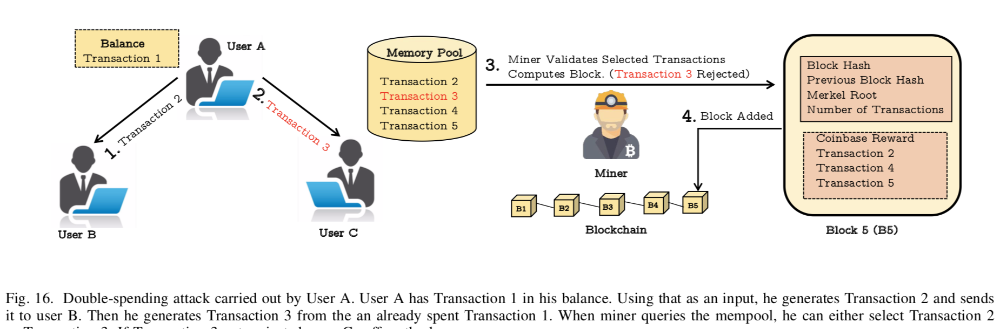  
网络部分V-F中的共识延迟，BGP攻击，对内存池的泛洪攻击或51％攻击部分V-B可能导致验证和传播过程中的额外延迟，这增加了攻击者执行双重花费的机会。 2013年3月，由于软分叉，比特币成功进行了价值10,000美元的双重支出交易。  
### C. 挖矿劫持  
挖矿劫持是一种攻击形式，在网络和基于云的服务上发起，在未经同意的情况下非法执行基于区块链的PoW挖矿。最近以及最普遍的加密劫持形式是浏览器内挖矿，将网站转变为矿池。PoW需要处理器密集的数学计算，这通常涉及找到目标散列值。随着加密货币网络的聚合哈希率增加，计算块的相关难度也增加。为了满足这些难度要求，矿工们使用了诸如GPU和ASIC芯片等复杂的硬件。矿池通过邀请更多矿工加入他们的池并购买具有更好计算能力的昂贵硬件来扩展其散列能力。因此，主要比特币系统中的采矿过程成为一种昂贵且具有竞争力的游戏，可以防止小型矿工独立开采区块。  
#### 1）基于云的挖矿劫持：  
为了弥补这一点，恶意矿工已经找到了通过劫持远程设备处理器来增加挖矿哈希能力的方法。这种攻击被称为隐蔽挖矿或挖矿劫持，它涉及劫持目标设备以执行攻击者的PoW计算。最初，针对云服务提供商发起了这些攻击，恶意用户在虚拟机和耗尽的云资源上执行隐蔽的挖矿操作。 Tahir等人首次注意到这种行为，他们还提出了一种名为“MineGuard”的软件工具形式的对策，以有效地检测和阻止云中的隐蔽采矿作业。  
#### 2）Web 挖矿劫持：  
2017年，挖矿劫持被带到了网络上，如图17（a）所示，其受欢迎程度一直在提高。  
  
基于Web的加密攻击被攻击者使用，他们未经访问者将恶意JavaScript挖矿代码注入到网站中。在基于浏览器的挖矿攻击中，客户端设备上的Web浏览器执行JavaScript代码，该代码与远程dropzone服务器建立WebSocket连接。然后，服务器将目标发送到客户端，客户端计算PoW的哈希值并将它们发送回服务器。在此过程中，设备所有者仍然不知道此后台活动，并无缝继续浏览网站。浏览器内的挖矿劫持不仅会造成严重的隐私威胁，而且还会损害访问设备的性能，因为基于PoW的哈希计算是处理器密集型的，可能会导致CPU使用率过高和电池耗尽。为了进一步促进这些攻击，2017年出现了诸如coinhive和crypto-loot等在线平台，为攻击者和网站所有者提供简单的代码片段。这些服务将网站与其平台服务绑定，并在网站的访问者计算机上执行挖矿劫持。  
Coinhive是网站上最受欢迎的挖矿劫持平台，它与名为Monero的加密货相关联。在图19中，我们提供了攻击者用来将受害者网站绑定到Coinhive帐户的JavaScript加密包装代码。  
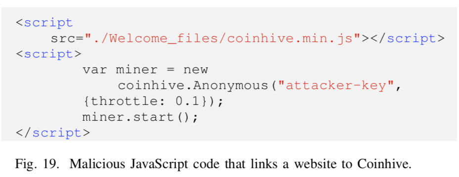  
代码清单显示，当浏览器加载coinhive.min.js文件时，它会与coinhive服务器建立WebSocket连接，并传递攻击者的密钥以与dropzone服务器绑定。然后它接收一个挖矿目标并通过相同的套接字连接将相应的哈希值提交给服务器。限制参数控制受害在图17（b）和图17（c）中，我们绘制了处理器启用了JavaScript和禁用JavaScript的四个加密网站。 可以注意到，启用JavaScript时，每个网站都使用不同的CPU功率，这表明限制参数的阈值不同。 图17还显示，当禁用JavaScript时，浏览器无法执行恶意脚本，也无法执行挖矿劫持。  
浏览器内挖矿劫持是一种相对较新的与基于PoW的区块链应用程序相关的攻击，因此没有先前的研究可以查看此攻击的操作和影响。然而，由于新闻中报道的事件，可以推断出加密劫持随着时间的推移变得越来越流行。在17（a）中，我们显示了术语“Cryptojacking”，“Coinhive”和“Monero”的流行度指数，由Google分析基于搜索计数记录17（a）中的结果显示，自2017年10月以来，每个术语的搜索量都有所增加，表明用户对密码攻击的兴趣。此外，在图18中，我们显示了这些搜索的全局分布。  
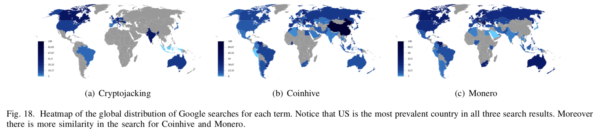  
#### 3）案例研究：  
研究界认为，挖矿劫持被认为是比特币系统安全和隐私的新威胁。赛门铁克最新的互联网安全威胁报告（ISTR）显示，2017年对网站的加密攻击攻击增加了8500％。 2018年2月，发起了一场大规模的挖矿劫持攻击，导致全球4000多个网站受到攻击，包括英国国家健康服务（NHS）和美国联邦司法机构网站。英国国家网络安全中心（NCSC）在其年度网络安全报告中宣布挖矿劫持是一个“重大威胁”。  
### D. 钱包盗窃  
如果与系统中的对等方相关联的凭证（例如密钥）存储在数字钱包中，则“钱包盗窃”攻击会对应用程序产生某些影响。例如，在比特币中，钱包默认存储为未加密，允许黑客读取与其相关的凭证以及由其发布相关的交易。即使在主机上安全地保护钱包，在主机上发起恶意软件攻击也会让黑客窃取钱包。最后，由于许多第三方服务可以存储钱包，这些服务也可能受到损害，钱包可能泄露给对手。  
#### 实例探究  
2017年12月，一家价值6300万美元的比特币从加密货币公司NiceHash的钱包中被盗。在黑客攻击期间，NiceHash的比特币钱包中的所有内容都被盗了。 2017年11月，Tether Treasury钱包遭到黑客入侵，价值3100万美元的比特币被盗。同样在2017年11月，用户删除了名为Parity Technologies的公司托管的数字钱包中的代码后，价值2.8亿美元的以太坊被锁定。 2016年7月，社交媒体区块链“Steemit”遭到攻击，价值85,000美元的数字货币从260个账户中被盗。 2015年1月，Bitstamp的比特币钱包遭到黑客入侵，造成价值510万美元的比特币损失。  
#### 密钥泄露和盗窃  
基于区块链的加密货币中的一个众所周知的问题是私钥泄露和盗窃。如果攻击者获得属于用户的私钥，他可以代表用户签署并生成新的交易，并可能将他的余额用于未经授权的接收者。 Brengel等人通过研究用于ECDSA随机重用的比特币区块链来研究比特币中的密钥泄漏。他们的结果表明，ECDSA nonce重用被误用于比特币以代表用户生成交易。同样，Breitner等人对比特币，以太坊和Ripple进行密码分析攻击，以暴露他们的私钥。他们使用基于点阵的算法来计算在偏向签名中使用的私有ECDSA密钥。  
#### 软件客户端漏洞  
比特币和以太坊等公共区块链应用程序具有开源软件客户端，使用户能够与网络连接。随着时间的推移，将发布新的软件版本，实施新的规则和升级。还发布了升级以修复旧版本中的漏洞。在比特币中，比特币核心v0.15及更低版本易受拒绝服务攻击。此漏洞在新发布的v0.16中进行了修补。但是，并非所有节点都下载新发布的版本。他们继续使用旧的软件客户端，并继续暴露其漏洞。在表VIII中，我们展示了比特币软件客户端采用的多样性。  
  
请注意，只有36.28％的节点使用的是最新的软件版本，该版本不受拒绝服务攻击。  
此外，攻击者可利用开源代码发布带有恶意代码和错误的新更新。如果用户安装该软件，它可以让攻击者发起各种攻击，包括DDoS，余额盗窃等。因此，有必要从可信平台下载软件客户端。  
### E. 智能合约中的攻击  
由于新的应用程序建立在区块链之上，因此它们自身的局限性以及区块链漏洞会创建一个新的攻击面。智能合约属于区块链2.0的一代，在本节中，我们将探讨智能合约中的攻击可能性。数字世界中最着名的智能合约应用是以太坊，它使用Solidity编程语言编写合同。 Solidity是一种面向合约的语言，受Javascript，Python和C++的影响。编程语言，执行环境和编码风格的缺陷可能导致一系列攻击。在图20中，我们演示了一个易受攻击的智能合约代码，可以窃取发件人的余额。  
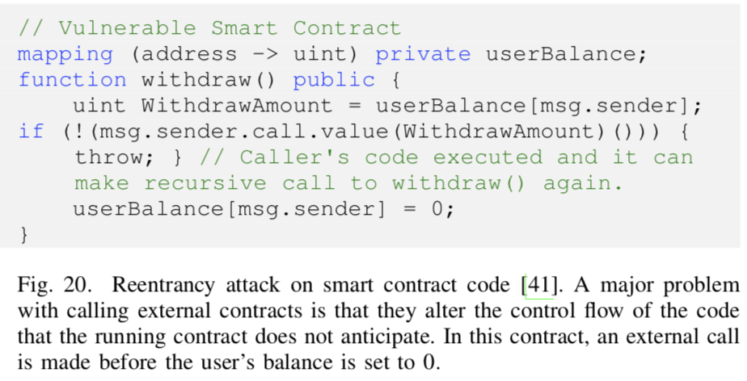  
“DAO”在他们的智能合约中也存在类似的漏洞，导致5000万美元的损失。一些众所周知的对以太坊智能合约的攻击包括重入攻击，流量攻击和流量攻击，重放攻击，短地址攻击和重新排序攻击。  
#### 1）可重入攻击：  
在重入攻击中，如果用户在发送以太币之前没有更新余额，攻击者可以通过递归调用ERC20令牌中的call.value（）方法来窃取合约中存储的所有以太币。因此，如果粗心用户忘记更新余额，他可能会失去合约中的全部余额。  
#### 2）DoS攻击：  
智能合约中的DoS攻击使恶意行为者能够为自己保留资金和权限。考虑智能合约拍卖的一个例子，其中恶意竞标者试图成为图22中所示的拍卖的领导者。  
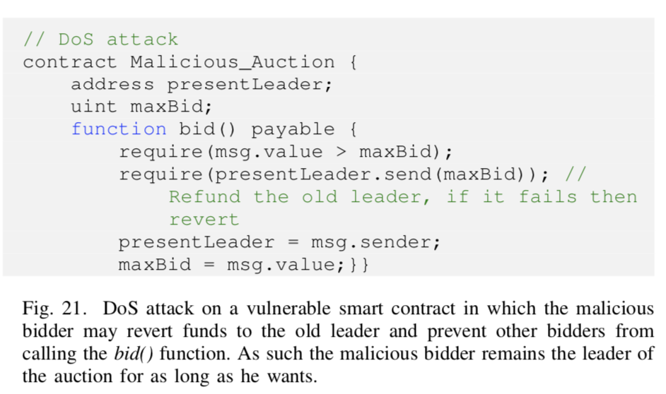  
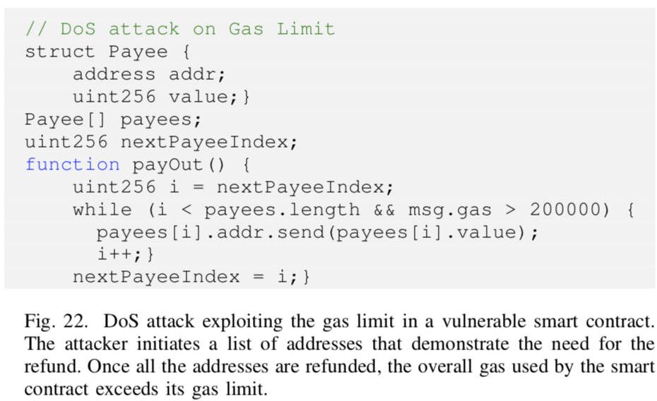  
  
弱势合约阻止退还给合同的旧领导者并使攻击者成为新的领导者。此外，它取消了其他投标人发送的所有bid()请求，并使攻击者成为拍卖的领导者。在以太坊智能合约中另一种形式的DoS攻击涉及利用合约设定的Gas限制，图21.在以太坊中，如果执行时智能合约消耗的总气体超过天然气限制，则合同交易失败。  
攻击者可以通过添加多个具有退款需求的地址来利用此功能。执行后，退还这些地址所需的Gas可能超过总Gas限额，从而取消最终交易。  
  
#### 3）溢出攻击：  
当超过类型变量（2的256次方）的值时，智能合约中的溢出发生。例如，在线下注的智能合约中，如果有人发送大量以太，超过（2的256次方），则下注的值将设置为0.尽管交易值大于（2的256次方）是不现实的，但是它仍然是用Solidity编写的智能合约中的编程漏洞。  
#### 4）短地址攻击：  
短地址攻击利用以太坊虚拟机中的一个错误，在有限的购买上制作额外的令牌。短地址攻击主要适用于ERC20令牌。对于此攻击，攻击者创建一个以0位结尾的以太坊钱包。然后他通过删除最后的0来对地址进行购买。如果合约有足够的余额，那么买入功能不会检查发件人的地址，而以太坊的虚拟机会追加缺少的0来完成地址。因此，对于购买的每1000个代币，机器返回256000个代币。  
#### 5）强制余额转移  
在易受攻击的智能合约代码中，可以在没有回退功能的情况下强制余额转移到合同。这可用于消耗Gas限制并禁止最终交易。  
### F. 重放攻击  
重放攻击涉及在两个不同的区块链上进行一次交易。例如，当加密货币分为两种不同的货币时，用户在两种分类账中持有相同的资产。用户可以选择在两个链中的任何一个上执行交易。在重放攻击中，攻击者嗅探一个分类账上的交易数据并在另一个分类账上重播。因此，用户在两个链上都会丢失资产。一个简单的案例可以从以太坊中得出。  
在以太坊中，在一个区块链上签署的交易在所有区块链上有效。因此，可以在公共网络上复制在测试网络上进行的交易以窃取资金。虽然以太坊已采取对策来通过在交易中加入chainID来防止重放攻击，但未启用此钱包功能的用户仍然容易受到攻击。  
### G. 应对面向应用的攻击  
对区块链应用程序的攻击有各种可能的对策。例如，为了保护块，建议保留钱包的备份并保护用于签名事务的密钥。密码很容易破解，所以需要使用强密码来防御暴力攻击。但是，更改密码不会更改由它们保护的密钥，从而使这些密钥因先前泄密的密码而易受攻击。钱包加密是原始比特币设计中的标准做法，因此高度推荐用于应对易受攻击的密钥。其它应对钱包安全的机制包括<u>保险</u>，从技术上讲，它不能通过纠正其后果来解决问题。密钥和钱包的备份是必不可少的，因为如果密钥丢失，则无法访问钱包，如果某些攻击者删除了钱包，则所有硬币都将丢失。  
加密货币的新模型，例如“Zcash”，为交易用户和交换金额提供链匿名性。因此，“Zcash”区块链的屏蔽架构可防止区块隐私攻击。双重攻击很容易在快速网络中解决，但是当网络的特点是高延迟和更长的块挖掘时间时就不会解决。处理该问题的一种可能方法是利用一次（或几次）签名，例如XMSS，如果他试图加倍花费，则显示用户的私钥。但是，这需要更改区块链应用程序使用的当前签名算法。其他提议包括减少区块链的难度参数以实现快速块挖掘，这是一种合理的方法，除了它将进一步促进自私挖掘和过时块的速率。  
以太坊中对智能合约的所有主要攻击都与编程平台的漏洞或无关的编程实践有关。通过修补以太坊虚拟机（EVM）中的漏洞并避免智能合约中的编程错误，可以防止这些攻击。  
为了对抗云中的挖矿劫持等。提出了“MineGuard”，可以检测虚拟机中处理器的异常使用情况。为了减少浏览器内的挖矿劫持，信誉良好的网络浏览器（包括Chrome和Firefox）推出了可以主动检测传输PoW的WebSocket连接的Web扩展。但是，截至目前，扩展使用黑名单方法来发现具有其局限性的WebSocket流量。例如，有权访问黑名单的攻击者可以通过在主机和dropzone服务器之间使用中继服务器轻松绕过检测。截至目前，加密劫持及其防御是公开挑战，需要社区更多关注。  
## VII. 相关工作  
调查的工作包括先前研究区块链应用及其安全漏洞的研究工作。在此过程中，我们还参与了综合学术比特币研究档案馆（CABRA），这是一份涵盖区块链系统正在进行的研究的900多篇研究论文的综合列表。CABRA受到Brett Scott维护的区块链论文的时间顺序列表的影响。从这些有用的资料库中，我们列出了本研究的相关论文清单，作为起点指南。  
通过各种调查已经多次尝试了解区块链的攻击面，我们将其与下面的工作进行对比。为了分析区块链的攻击面，李等人通过研究流行的区块链应用程序（包括比特币，以太坊和Monero），调查了区块链的各种安全方面。他们评估了区块链应用程序对流行攻击的稳健性以及与每次攻击相关的风险因素。虽然在攻击调查中是全面的，但他们的工作却没有考虑对策。 Conti等调查了比特币的安全性和隐私性。虽然比特币是分析区块链攻击面的一个激励性例子，但是区块链已经超越了比特币并且它们的攻击面也相应地增加了。此外，他们的工作不包括与区块链应用相关的新攻击，例如挖矿劫持等。塔拉等人探讨了区块链技术在提供分布式安全服务中的应用。他们主要关注使用区块链来提供服务，包括身份验证，机密性，出处和完整性保证。相比之下，我们的工作致力于研究滥用区块链及其应用。安德森等人研究了在新兴的区块链应用中使用新的共识方案，如Namecoin和Peercoin。他们还调查了这些应用程序的各种安全功能，重点是智能合约。在类似的背景下，Atzei等人还探讨了限于以太坊智能合约的各种攻击。与现有文献相比，我们的工作超越了概述新攻击，其影响，防御和相关案例研究的最新技术。  
Kiran和Stanett对比特币进行风险分析，涵盖其漏洞和攻击面。他们还探讨了与比特币和加密货币市场经济相关的风险因素，包括通货紧缩，波动性和同谋。贝克尔等人概述了与基于PoW的区块链应用程序相关的挑战和安全风险。 Moubarak等人探讨了三种主要区块链应用程序的安全挑战，即比特币，以太坊和Hyperledger。然而，他们的工作更多地针对应用程序攻击，并没有考虑与区块链的加密构造和P2P结构相关的攻击。  
卡尔斯滕等人在没有区块奖励的情况下分析了比特币的安全特征。由于比特币中的硬币数量是确定性的，并且硬币奖励最终会在所有硬币被开采时结束，因此系统中的矿工将采取可能影响比特币安全属性的范式转变。因此，有一种隐含的信念，即这可能不会改变比特币的攻击面。然而，在另一篇论文中，作者概述了这种信念的局限性，并提出了新的攻击途径及其影响。  
随着区块链应用程序的不断发展，它们每天都面临着新的和更复杂的攻击。在本文中，我们将研究先前的工作，并介绍新出现的区块链应用程序的漏洞和攻击。我们还报告了与每次攻击相关的重大事件和案例研究，并为研究和分析提供了未来方向。在表IX中，我们概述了我们工作中讨论的每种攻击的可能对策及其有效性。  
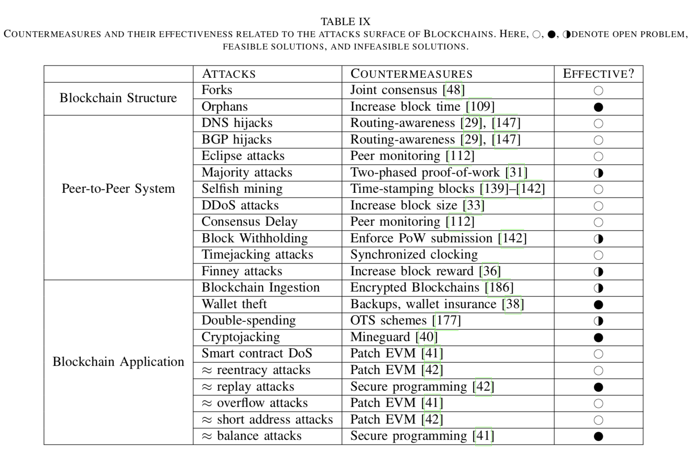  
确定对策有效性的标准是它如何完全或部分地解决问题。例如，减少孤块的一种方法是增加以太坊中的块时间。但是，这也可能会以增加交易验证时间为代价。因此，该解决方案部分地解决了该问题。此外，在图25中，我们提供了各种攻击及其对策的说明。  
  
请注意，某些对策可能会解决多个攻击，从而成为一个通用的解决方案，这可以用来激励未来的研究方向，优先防御。  
### A. 区块链结构攻击  
分析与区块链数学结构相关的问题，Eyal等人提出了一种拜占庭容错区块链协议，解决了区块链分叉的问题。 Decker和Wattenhofer观察了比特币网络中的信息传播，并引入了一个解释区块链分叉形成的模型。根据他们的结果，他们得出结论，块传播的延迟是区块链分叉的主要原因。 Kiffer等人分析了以太坊的设计空间，并研究了一个大型的分叉，将以太坊划分为两个独立的网络（以太坊和以太坊经典）。他们通过探索结果可能带来的收益和安全漏洞，进一步分析了分叉对用户，矿池和两个网络的影响。  
### B. 点对点系统  
对于比特币的路由攻击和空间划分，Apostolaki等人注意到，通过在比特币中劫持少于100个边界网关协议（BGP）前缀，攻击者可以隔离高达50％的网络哈希率。他们进一步分析了比特币托管是高度集中的，13个ISP拥有超过30％的总采矿流量。高度集中化使比特币容易受到路由攻击，延迟攻击和DNS攻击。他们还表明，每月有超过100个比特币节点成为BGP劫持的受害者。在本文（第V-C节）中，我们验证了Apostolaki等人的研究结果。 另一个论文并表明，随着时间的推移，比特币网络进一步集中在AS和ISP上，这将是形成更大的分区攻击漏洞。  
布拉德伯里回顾了对比特币的各种攻击，即51％的攻击，基于代码的攻击，双重支出和粉尘交易。受到Block Preholding（BWH）攻击的启发，Kwon等人提出了扣块攻击（FAW）预防方案，保证了对矿池的更多回报。在纳什均衡中，当两个矿池相互进行BWH攻击时，它们都会遭受损失。然而，在目前的比特币系统中，FAW攻击的回报至少比BWH攻击高出56％。  
Eyal和Sirer模拟了区块链的挖掘过程，并得出结论，比特币挖矿协议不是激励兼容的。他们还假设更高的奖励可能导致新矿工加入自私的矿池，因此可能导致多数攻击。 Sapirshtein等人研究了最优的自私挖掘策略。在他们的工作中，他们分析了成功进行自私挖矿攻击所需的资源比例。它们还提供了一种界限，在这种界限下，区块链系统可以被认为可以抵御这种攻击。Heilman和Solat以及Potop-Butucaru 提出了自私挖矿和扣块攻击的对策。海尔曼利用不可伪造的时间戳来提高采矿门槛，以防止进行自私挖矿。Bastiaan通过对两个阶段性工作证明（2P-PoW）的随机分析提出了对51％攻击的防御，最初由Eyal和Sirer提出。 2P-PoW可防止矿池的哈希速率超出限制。它通过强制池所有者减少其散列功率或放弃其私钥来实现。  
对区块链和内存池的DDoS攻击领域仍然是一个悬而未决的问题，因此，提出的对策，其中包括：增加吞吐量，增加块大小和限制事务的大小。由于DDoS攻击在对等体系结构中以不同的方式表现出来，而不是集中式系统，因此它们的预防也需要非传统方法。  
### C. 区块链应用程序攻击  
之前的工作已经完成，可以看到与区块链应用程序相关的攻击事件，包括双重支出，智能合约，钱包盗窃等。然而，随着新应用程序的出现，区块链正在演变为区块链3.0，他们的攻击面正在扩大，并为安全和隐私带来新的挑战。Rosenfeld在不同的哈希率和确认次数下对成功的双重支出方案进行了定量分析。Solà等人使用修改的签名方案，该方案在快速交易中公开双重支出的私钥。他们提出的方法保护比特币中的乐观用户，他们可能愿意在确认收到的交易之前提供产品。 Atzei等人分析了对以太坊智能合约的可能攻击，重点是DAO攻击。他们根据与以太坊编程语言“Solidity”，以太坊虚拟机（EVM）和以太坊区块链相关的漏洞对攻击进行分类。陈等人为以太坊引入了一种自适应Gas成本机制，以抵御价格低廉的拒绝服务攻击。 Luu等人调查了黑客可能在以太坊中攻击智能合约的各种可能性。他们还开发了一个符号执行工具OYENTE，它可以主动查找和修补以太坊智能合约中的错误。  
为了观察区块链摄取攻击和比特币上的隐私泄漏，Fanti和Viswanath研究了比特币点对点的匿名性，并得出结论，网络的安全性较弱。为了增强比特币的隐私和匿名性，Ziegeldorf等人提出了分散混合服务和混洗协议，以减少交易易监测性的可能性。虽然社区已经解决了对区块链的常规攻击，但是没有深入探讨诸如挖矿劫持和洪水等新的攻击。通过在本文中引起人们的注意，我们希望我们能够积极研究这些攻击的对策。  
## VIII. 讨论和开放的方向  
近年来，由于分散式系统的使用越来越多以及对防篡改数据管理的需求不断增长，区块链已经变得越来越流行。因此，它们被用于多个领域，如物联网，医疗保健，电子投票，电子政务解决方案和供应链。但是，在将此类遗留系统与区块链集成之前，完全了解其安全属性和攻击面是恰当的。希望改进其安全模型的传统应用程序可能通过使用区块链进一步暴露于更高的风险。例如，供应链中对延迟敏感的应用程序无法承受事务传播中的异常延迟，而电子投票等数据敏感应用程序无法承担双重花费的事务。虽然这些攻击在传统的客户端 - 服务器模型中可能是不可行的，但使用区块链可能会为它们创建新的攻击途径。攻击者可以发起共识延迟攻击以阻止供应链中的信息传播，或者创建双重花费的交易以使合法用户的投票无效。此外，如第IV部分所述，一旦欺诈活动成为区块链的一部分，系统将需要一个硬分叉来扭转交易。因此，区块链的使用可能会为其他安全的应用程序带来新的攻击途径。鉴于这些变化，我们认为对区块链攻击面进行系统化处理以暴露其漏洞并为新兴应用概述新的威胁模型是非常重要和及时的。作为我们研究的结果，在下文中，我们将讨论所学到的主要经验教训以及可以引导未来研究的开放方向。  
### A. 主要经验教训  
根据我们的分析，我们注意到区块链的对等架构是区块链攻击面的最主要类别。特别是在公共区块链中，网络的拓扑不对称性很容易被利用来危害系统。此外，由于公共区块链是无权限的，因此网络对合法用户以及攻击者仍然是公正的。此属性进一步削弱了安全模型，因为攻击者可以对所有资源进行开放访问。  
此外，网络层允许外部实体影响区块链应用程序的内部操作。例如，区块链网络外部的ISP可以劫持BGP前缀以隔离对等体。如果针对矿池启动此类攻击，则网络的哈希率将受到影响，从而导致事务停顿。其他外部对手包括竞争的区块链应用程序，国家/地区，云服务提供商和DNS服务器，它们可能会中断流量以影响目标区块链应用程序的活动。虽然通过使用私有区块链可以减少外部实体的影响，但这可能只能部分解决问题。私有区块链可以通过限制系统信息的暴露来增强网络条件，但是，它们也允许选择性对等方参与，从而限制了应用程序的范围。  
我们工作的另一个要点是需要开发能够替代PoW和PoS的节能且安全的共识协议。通过比特币，我们了解到PoW的能耗非常高。此外，PoW还导致区块链中的竞争条件，其中矿工竞争块奖励。竞争条件最终会促进诸如自私挖矿，51％攻击，双重支出，分叉和旧块等攻击。为了解决能源效率低下和避免竞争条件，已经提出使用拍卖过程进行区块挖掘的PoS。但是，我们已经证明PoS可以在系统中创建网络集中化和不公平性。尽管PBFT在私有区块链中作为PoS和PoW的替代方案很好，但是它具有高消息复杂性和低可扩展性。这是其在公共区块链中使用的主要挑战。  
我们还表明，智能合约的编程灵活性不断提高，使传统的区块链应用程序更加脆弱。例如，在以太坊中，可以启动可重入攻击和溢出攻击来窃取用户的余额。这种攻击无法在比特币，Ripple和Zcash上启动，这些攻击不能为用户提供编程灵活性。此外，我们还报告说，在应用层使用区块链也会产生新的攻击途径。例如，通过利用开源客户端软件，攻击者可以访问其私钥并盗取余额。因此，需要仔细处理面向应用程序的区块链使用以避免攻击。  
总之，我们工作的关键要点是：  
1）在分布式环境中更安全地部署区块链，  
2）开发公平有效的共识算法，  
3）区块链层与应用层的安全交互，以避免漏洞和攻击。  
### B. 开放性挑战  
区块链攻击面中的一些开放挑战如表IX所示。可以看出，路由攻击没有有效的对策，目前的区块链应用程序尚未采取措施解决这些问题。例如，如表VII所示，如果恶意ISP劫持阿里巴巴拥有的AS，它可以劫持超过50％的比特币哈希率。结果是，比特币中的块生成将停止，从而导致事务确认延迟。如果我们分析比特币的空间行为，我们观察到节点集中度随着时间的推移而增加，表明网络没有响应劫持的威胁。表IX中还显示了区块链应用程序的某些策略已经创建了仍然存在问题的攻击途径。在比特币和以太坊中，块大小限制和块生成时间导致泛洪攻击和共识延迟。这些应用程序应修改其策略以防止此类攻击。此外，大多数区块链应用程序未来可能遇到的一个发展中的问题是它们的高存储容量。由于追加模型，区块链的线性增长导致高存储成本。虽然这个问题在加密货币中显得微不足道，但当区块链在数据密集型应用程序（如供应链）中引入时，它将变得非常重要。一个天真的解决方案是使用支付渠道网络从主要区块链中卸载交易活动。但是，使用支付渠道会掩盖主区块链上的数据透明度，也可能会受到隐私问题的影响。因此，需要更多的研究来提出有效的解决方案。  
  
## IX. 结论  
在本文中，我们探讨了区块链技术的攻击面。 我们将攻击归因于区块链的加密结构，底层的通信架构以及应用它们的上下文。 在此过程中，我们强调了主要威胁和正在进行的安全研究活动。 我们认为，对区块链的各种攻击仍然可以发动，不能承受当前和现有的防御，并且其中一些攻击可以用来促进其它几种攻击。 通过概述这些攻击并调查其对策，我们强调了为更安全有效地使用区块链而需要采取的新研究方向。  
  
